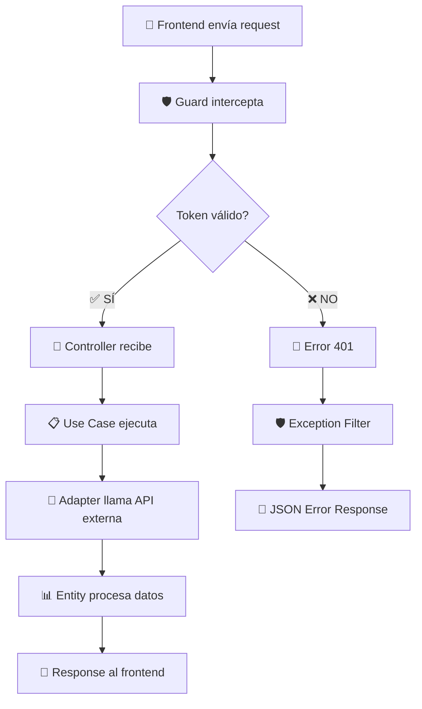
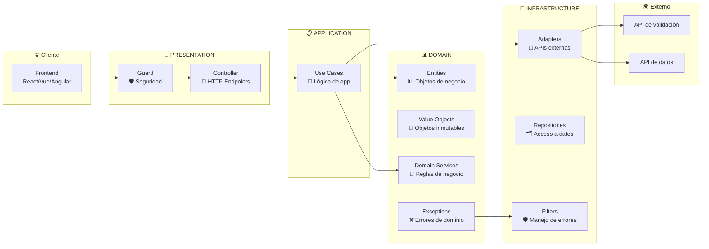
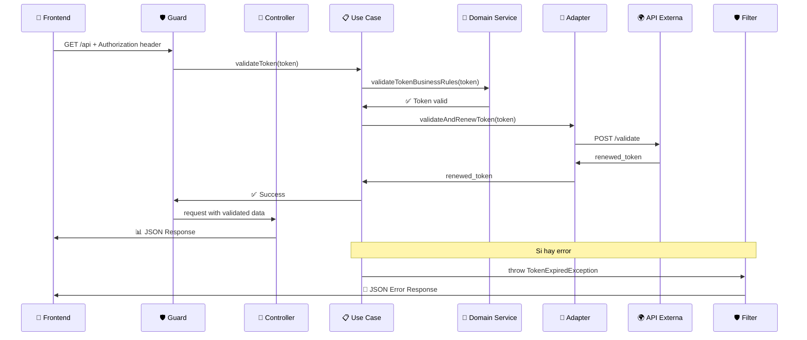

# 🚀 BFF NestJS - Arquitectura DDD desde Cero

**Backend For Frontend (BFF)** armado con **NestJS** usando **Arquitectura Domain-Driven Design** para validar tokens JWT y manejar datos externos.

## 📋 Contenido

- [¿Qué carajo es esto?](#qué-carajo-es-esto)
- [Instalación desde cero](#instalación-desde-cero)
- [Cómo crear este proyecto paso a paso](#cómo-crear-este-proyecto-paso-a-paso)
- [Arquitectura explicada](#arquitectura-explicada)
- [Estructura del proyecto](#estructura-del-proyecto)
- [Cómo usar este proyecto](#cómo-usar-este-proyecto)
- [Gráficos de la arquitectura](#gráficos-de-la-arquitectura)

## 🤔 ¿Qué carajo es esto?

Mirá, esto es un **servidor** (backend) que actúa como intermediario entre tu aplicación frontend y otros servicios. Es como el portero de un edificio:

- 🛡️ **Valida credenciales** (tokens JWT) - "¿Tenés pase para entrar?"
- 🔄 **Se conecta con otras APIs** - "Voy a buscar tus datos"  
- 📡 **Responde al frontend** - "Acá tenés lo que pediste"
- ❌ **Maneja errores** - "No podés pasar porque tu pase está vencido"

### ¿Para qué sirve?
Si tenés una app React, Vue, o lo que sea, este servidor:
1. Recibe requests de tu app
2. Revisa si el usuario puede hacer lo que pide
3. Va a buscar datos a otros servicios si hace falta
4. Te devuelve todo listo para mostrar

## 🔧 Instalación desde cero

### Pre-requisitos (lo básico que necesitás)

#### 1. Node.js (el motor de JavaScript)
```bash
# Verificar si ya lo tenés
node --version
npm --version

# Si no tenés Node.js, bajalo de: https://nodejs.org/
# Necesitás la versión 18 o superior
```

#### 2. Editor de código (recomendado)
- **VS Code** (gratis): https://code.visualstudio.com/
- Extensiones útiles: "TypeScript", "NestJS Files"

#### 3. Postman (para probar APIs)
- Descargar: https://www.postman.com/

#### 4. Git (para versionar código)
```bash
# Verificar si tenés git
git --version

# Si no lo tenés: https://git-scm.com/
```

### Instalación global de herramientas

```bash
# Instalar NestJS CLI globalmente (para crear proyectos)
npm install -g @nestjs/cli

# Instalar TypeScript globalmente (recomendado)
npm install -g typescript

# Verificar que se instaló todo
nest --version
tsc --version
```

## 🚀 Cómo crear este proyecto paso a paso

### Paso 1: Crear proyecto NestJS desde cero

```bash
# Crear nuevo proyecto
nest new mi-bff-proyecto

# Elegir npm como package manager
# Entrar al proyecto
cd mi-bff-proyecto

# Probarlo
npm run start:dev
```

Deberías ver algo como:
```
[Nest] Starting Nest application...
[Nest] Nest application successfully started +2ms
```

### Paso 2: Instalar dependencias adicionales

```bash
# Para hacer requests HTTP a otras APIs
npm install @nestjs/axios axios

# Para manejar JWT (tokens de autenticación)  
npm install jsonwebtoken
npm install -D @types/jsonwebtoken

# Para validación de datos
npm install class-validator class-transformer

# Para variables de entorno
npm install dotenv

# Para generar respuestas HTTP consistentes
npm install @nestjs/common @nestjs/core
```

### Paso 3: Configurar estructura DDD

```bash
# Crear carpetas siguiendo Domain-Driven Design
mkdir -p src/shared/domain/exceptions
mkdir -p src/shared/application/exceptions  
mkdir -p src/shared/infrastructure/exceptions
mkdir -p src/shared/infrastructure/filters

mkdir -p src/modules/auth/domain/entities
mkdir -p src/modules/auth/domain/value-objects
mkdir -p src/modules/auth/domain/repositories
mkdir -p src/modules/auth/domain/services
mkdir -p src/modules/auth/domain/exceptions

mkdir -p src/modules/auth/application/use-cases

mkdir -p src/modules/auth/infrastructure/controllers
mkdir -p src/modules/auth/infrastructure/adapters
mkdir -p src/modules/auth/infrastructure/guards
mkdir -p src/modules/auth/infrastructure/exceptions
```

### Paso 4: Configurar archivo de entorno

```bash
# Crear archivo .env
touch .env
```

Agregar en `.env`:
```env
# Puerto donde va a correr el servidor
PORT=3001

# URL de API externa para obtener datos (ejemplo con PokeAPI)
EXTERNAL_API_BASE_URL=https://pokeapi.co/api/v2

# URL para validar tokens (ejemplo con httpbin para testing)
TOKEN_VALIDATION_API_URL=https://httpbin.org/post
```

### Paso 5: Configurar TypeScript

Editar `tsconfig.json`:
```json
{
  "compilerOptions": {
    "module": "commonjs",
    "declaration": true,
    "removeComments": true,
    "emitDecoratorMetadata": true,
    "experimentalDecorators": true,
    "allowSyntheticDefaultImports": true,
    "target": "ES2020",
    "sourceMap": true,
    "outDir": "./dist",
    "baseUrl": "./",
    "incremental": true,
    "skipLibCheck": true,
    "strictNullChecks": false,
    "noImplicitAny": false,
    "strictBindCallApply": false,
    "forceConsistentCasingInFileNames": false,
    "noFallthroughCasesInSwitch": false,
    "paths": {
      "@shared/*": ["src/shared/*"],
      "@modules/*": ["src/modules/*"]
    }
  }
}
```

### Paso 6: Scripts útiles en package.json

Agregar en `package.json`:
```json
{
  "scripts": {
    "build": "nest build",
    "start": "node dist/main",
    "start:dev": "nest start --watch",
    "start:debug": "nest start --debug --watch",
    "start:prod": "node dist/main",
    "lint": "eslint \"{src,apps,libs,test}/**/*.ts\" --fix"
  }
}
```

## 🏛️ Arquitectura explicada

### ¿Qué es Domain-Driven Design (DDD)?

Imaginate que estás construyendo una empresa. DDD es como organizar los departamentos:

#### 📊 **Domain (Dominio)** - "Las reglas del negocio"
- Como el CEO que define las reglas principales
- Ejemplo: "Un token vencido no puede usarse"
- **No depende de nada externo** (bases de datos, APIs, etc.)

#### 📋 **Application (Aplicación)** - "Casos de uso" 
- Como los gerentes que ejecutan los procesos
- Ejemplo: "Proceso para validar un usuario"
- **Orquesta** las reglas del dominio

#### 🔧 **Infrastructure (Infraestructura)** - "Conexiones externas"
- Como el departamento de IT que maneja las conexiones
- Ejemplo: "Llamar a la API de validación"
- **Se conecta** con bases de datos, APIs, archivos, etc.

### Arquitectura Hexagonal (Puertos y Adaptadores)

```
                🏢 APLICACIÓN
     ┌─────────────────────────────────┐
     │         📊 DOMAIN               │
     │    (Reglas de negocio)          │
     │                                 │
     │  ┌─────────────────────────┐    │
     │  │   📋 APPLICATION        │    │
     │  │   (Casos de uso)        │    │
     │  └─────────────────────────┘    │
     │                                 │
     └─────────────────────────────────┘
              │                │
    ┌─────────┴─────────┐     ┌┴──────────┐
    │  🔌 PUERTO HTTP   │     │ 🔌 PUERTO │
    │  (Controller)     │     │   API     │
    └─────────┬─────────┘     └┬──────────┘
              │                │
    ┌─────────┴─────────┐     ┌┴──────────┐
    │  🔧 ADAPTADOR     │     │ 🔧 ADAPT.  │
    │   (Express)       │     │ (Axios)   │
    └───────────────────┘     └───────────┘
```

## 📁 Estructura del proyecto

```
📦 mi-bff-proyecto/
├── 📁 src/
│   ├── 📄 main.ts                          # 🚀 Arranca todo (bootstrap)
│   ├── 📄 app.module.ts                    # 🏢 Módulo principal
│   │
│   ├── 📁 shared/                          # 🌍 Código compartido
│   │   ├── 📄 index.ts                     # 📦 Exports de todo
│   │   ├── 📁 domain/exceptions/           # ❌ Errores básicos
│   │   ├── 📁 application/exceptions/      # ❌ Errores de casos de uso  
│   │   └── 📁 infrastructure/
│   │       ├── 📁 exceptions/              # ❌ Errores técnicos
│   │       └── 📁 filters/                 # 🛡️ Maneja errores auto
│   │
│   └── 📁 modules/auth/                    # 🔐 Módulo de autenticación
│       ├── 📄 auth.module.ts               # ⚙️ Config del módulo
│       ├── 📄 index.ts                     # 📦 Exports del módulo
│       │
│       ├── 📁 domain/                      # 🏛️ NÚCLEO DEL NEGOCIO
│       │   ├── 📁 entities/                # 📊 Objetos principales
│       │   ├── 📁 value-objects/           # 💎 Objetos de valor
│       │   ├── 📁 repositories/            # 🗂️ Contratos para datos
│       │   ├── 📁 services/                # 🔧 Lógica de dominio
│       │   └── 📁 exceptions/              # ❌ Errores específicos
│       │
│       ├── 📁 application/                 # 📋 CASOS DE USO
│       │   └── 📁 use-cases/               # 🎯 Acciones que hace la app
│       │
│       └── 📁 infrastructure/              # 🔧 MUNDO EXTERIOR
│           ├── 📁 controllers/             # 📡 Maneja HTTP
│           ├── 📁 adapters/                # 🔌 Conecta con APIs
│           ├── 📁 guards/                  # 🛡️ Seguridad
│           └── 📁 exceptions/              # ❌ Errores técnicos
│
├── 📄 .env                                 # 🔧 Variables de entorno
├── 📄 package.json                         # 📋 Dependencias y scripts
├── 📄 tsconfig.json                        # ⚙️ Config de TypeScript
├── 📄 nest-cli.json                        # ⚙️ Config de NestJS
└── 📄 README.md                            # 📖 Este archivo
```

## 🚀 Cómo usar este proyecto

### 1. Clonar y configurar
```bash
# Clonar el repo
git clone <url-del-repo>
cd bff-nestjs-arquitectura-hexagonal

# Instalar dependencias
npm install

# Configurar variables (opcional, ya están configuradas)
cp .env.example .env
```

### 2. Ejecutar en desarrollo
```bash
# Modo desarrollo (se reinicia automáticamente)
npm run start:dev

# Deberías ver:
# 🚀 BFF is running on port 3002
# 📡 API available at: http://localhost:3002/api
```

### 3. Probar que funciona
```bash
# Sin token (debería dar error)
curl http://localhost:3002/api

# Respuesta esperada:
{
  "error": true,
  "statusCode": 401,
  "errorCode": "TOKEN_NOT_PROVIDED",
  "message": "Authorization token not provided",
  "layer": "Domain",
  "timestamp": "2025-08-20T08:12:06.857Z"
}
```

```bash
# Con token inválido
curl -H "Authorization: Bearer token-trucho" http://localhost:3002/api

# Respuesta esperada:
{
  "error": true,
  "statusCode": 401,
  "errorCode": "INVALID_TOKEN",
  "message": "Invalid token format or structure", 
  "layer": "Domain",
  "timestamp": "2025-08-20T08:12:06.857Z"
}
```

### 4. Generar token válido para probar
1. Andá a [jwt.io](https://jwt.io)
2. En "Payload" poné:
```json
{
  "sub": "1",
  "username": "messi",
  "iat": 1703980800,
  "exp": 2903980800
}
```
3. Copiá el token que genera
4. Probalo:
```bash
curl -H "Authorization: Bearer TU_TOKEN_AQUI" http://localhost:3002/api
```

### 5. Usar con Postman
1. Abrí Postman
2. Hacé un GET a `http://localhost:3002/api`
3. En Headers agregá:
   - Key: `Authorization`
   - Value: `Bearer TU_TOKEN_AQUI`

## 📊 Gráficos de la arquitectura

### Flujo completo de una request



### Arquitectura de capas



### Flujo de datos específico



## 🔧 Scripts útiles

```bash
# Desarrollo con auto-reload
npm run start:dev

# Compilar para producción
npm run build

# Ejecutar versión compilada
npm run start:prod

# Limpiar errores de código
npm run lint
```

## 🤝 Cómo extender este proyecto

### Agregar nuevo módulo (ej: usuarios)
```bash
# Crear estructura
mkdir -p src/modules/users/domain/entities
mkdir -p src/modules/users/application/use-cases
mkdir -p src/modules/users/infrastructure/controllers

# Crear módulo
nest g module modules/users --no-spec
nest g controller modules/users/infrastructure/controllers/users --no-spec
nest g service modules/users/application/use-cases/get-users --no-spec
```

### Cambiar API externa
1. Modificá `EXTERNAL_API_BASE_URL` en `.env`
2. Actualizá el adapter en `infrastructure/adapters/`
3. Ajustá las entities si cambia la estructura de datos

### Agregar nueva funcionalidad
1. **Domain**: Definí entities y reglas de negocio
2. **Application**: Creá use cases
3. **Infrastructure**: Implementá adapters y controllers
4. **Registrá** todo en el módulo correspondiente

## 🧠 Conceptos clave explicados

### ¿Qué es un "Guard"?
Es como el **portero de un edificio**. Decide si podés pasar o no antes de que llegues al controller.

### ¿Qué es "Dependency Injection"?
En lugar de que una clase cree sus dependencias, se las "inyectás" desde afuera. Es como darle las herramientas a un carpintero en lugar de que él las compre.

### ¿Qué es un "Use Case"?
Es un **manual de instrucciones** para hacer algo específico. Ej: "Cómo validar un usuario paso a paso".

### ¿Qué es una "Entity"?
Es un **objeto con identidad propia** que representa algo importante del negocio. Ej: un Token, un Usuario.

### ¿Qué es un "Value Object"?
Es un **objeto que no cambia** y se define por su valor, no por su identidad. Ej: un Email, una Fecha.

---

## 🎯 ¿Por qué esta arquitectura?

- **🔧 Mantenible**: Cada cosa tiene su lugar
- **🧪 Testeable**: Podés probar cada parte por separado  
- **📈 Escalable**: Fácil agregar nuevas funcionalidades
- **👥 Profesional**: Usada en empresas grandes
- **📚 Educativa**: Te enseña patrones importantes

---

**¡Ahora ya sabés cómo armar un BFF con arquitectura DDD desde cero, loco!** 🇦🇷

Para cualquier duda, revisá los comentarios en el código que están hechos para que entiendas todo paso a paso.