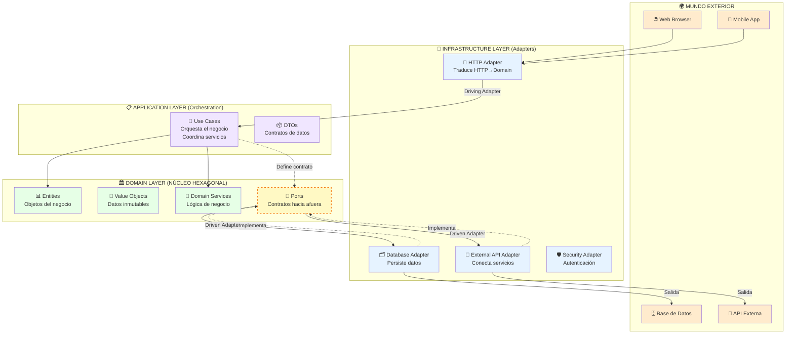
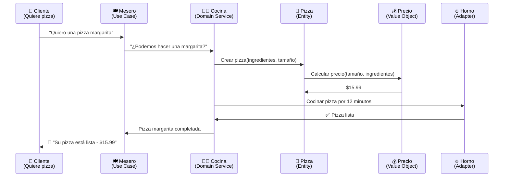
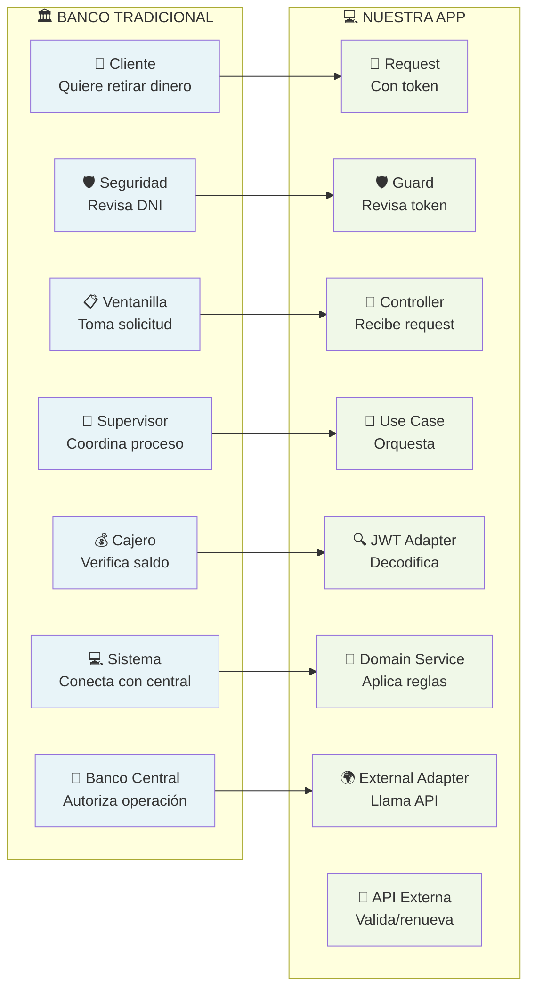

# 🏛️ Arquitectura Hexagonal con NestJS - Guía Completa desde Cero

**Aprende arquitectura de software profesional con ejemplos de la vida real**

---

## 📚 Tabla de Contenidos

1. [¿Qué es la Arquitectura Hexagonal?](#-qué-es-la-arquitectura-hexagonal)
2. [Domain-Driven Design (DDD)](#-domain-driven-design-ddd)
3. [Términos y Conceptos Clave](#-términos-y-conceptos-clave)
4. [Flujo de la Aplicación](#-flujo-de-la-aplicación)
5. [Explicación de Todos los Archivos](#-explicación-de-todos-los-archivos)
6. [Ejemplos de la Vida Real](#-ejemplos-de-la-vida-real)

---

## 🏛️ ¿Qué es la Arquitectura Hexagonal?

### 🔍 **Definición Simple**
La **Arquitectura Hexagonal** (también llamada "Ports and Adapters") es como organizar una empresa donde:
- **El núcleo del negocio** está en el centro (las reglas importantes)
- **Los departamentos externos** se conectan por "puertos" estandarizados
- **Cada departamento** puede ser reemplazado sin afectar el núcleo

### 🏗️ **Gráfico de Arquitectura Hexagonal**



### 🔑 **Conceptos Clave de la Arquitectura Hexagonal**

#### 🎯 **Driving Adapters (Adapters que Conducen)**
- **¿Qué son?** Adapters que **inician** acciones en el dominio
- **Ejemplos:** HTTP Controllers, CLI Commands, Message Consumers
- **Flujo:** Mundo exterior → Driving Adapter → Use Case

#### 🔄 **Driven Adapters (Adapters Conducidos)**
- **¿Qué son?** Adapters que son **utilizados** por el dominio
- **Ejemplos:** Database Repositories, External APIs, Email Services  
- **Flujo:** Use Case → Port → Driven Adapter → Mundo exterior

#### 🔌 **Principio de Inversión de Dependencias**
- **El dominio define QUÉ necesita** (Ports/Interfaces)
- **La infraestructura provee CÓMO hacerlo** (Adapters/Implementaciones)
- **El dominio NO conoce detalles técnicos** (no sabe de HTTP, DB, etc.)

### ✅ **Ventajas**

| Ventaja | Explicación | Ejemplo de la Vida Real |
|---------|-------------|------------------------|
| **🔄 Intercambiabilidad** | Cambias una parte sin afectar el resto | Cambiar de iPhone a Android - tus contactos siguen igual |
| **🧪 Testeable** | Pruebas cada parte por separado | Probar el motor de un auto sin necesidad del auto completo |
| **📈 Escalable** | Crece fácil cuando necesitas más | Agregar más empleados a una empresa bien organizada |
| **🔧 Mantenible** | Cada cosa tiene su lugar específico | Una casa donde cada cuarto tiene su propósito |
| **👥 Trabajo en equipo** | Varios desarrolladores pueden trabajar sin pisarse | Varios chefs en una cocina - cada uno en su estación |

### ❌ **Desventajas**

| Desventaja | Explicación | Ejemplo de la Vida Real |
|------------|-------------|------------------------|
| **📚 Complejidad inicial** | Más difícil de aprender al principio | Aprender a manejar - al principio parece imposible |
| **🏗️ Más archivos** | Muchos archivos para proyectos simples | Usar una empresa para vender limonada en la esquina |
| **⏰ Tiempo de desarrollo** | Tarda más en hacer cosas simples | Vestirse de gala para ir al supermercado |
| **🎓 Curva de aprendizaje** | Los juniors pueden confundirse | Un niño tratando de entender cómo funciona un banco |

---

## 🎯 Domain-Driven Design (DDD)

### 🔍 **¿Qué es DDD?**
**Domain-Driven Design** es como organizar una empresa enfocándose en **LO QUE HACE** la empresa, no en la tecnología que usa.

### 🏢 **Ejemplo: Pizzería vs. Software**

| Pizzería 🍕 | Software 💻 |
|-------------|-------------|
| **Cocina** (hace las pizzas) | **Domain** (reglas de negocio) |
| **Meseros** (toman pedidos) | **Application** (casos de uso) |
| **Caja registradora** (cobra) | **Infrastructure** (base de datos) |
| **Repartidores** (entregan) | **Controllers** (API endpoints) |

### 🧩 **Componentes de DDD**

#### 📊 **Entities (Entidades)**
```typescript
// Como una PERSONA - tiene identidad única
class Usuario {
  constructor(
    private id: string,      // 🆔 Su DNI - único e irrepetible
    private nombre: string,  // 📝 Puede cambiar de nombre
    private email: string    // 📧 Puede cambiar de email
  ) {}
  
  // 🔧 Comportamientos que PUEDE hacer una persona
  cambiarEmail(nuevoEmail: string) { /* ... */ }
  verificarIdentidad() { /* ... */ }
}
```

#### 💎 **Value Objects (Objetos de Valor)**
```typescript
// Como DINERO - se identifica por su valor
class Precio {
  constructor(
    private readonly monto: number,  // 💰 $100 siempre es $100
    private readonly moneda: string  // 🌍 USD, EUR, ARS
  ) {}
  
  // ✅ Dos precios de $100 USD son IGUALES
  equals(otro: Precio): boolean {
    return this.monto === otro.monto && this.moneda === otro.moneda;
  }
}
```

#### 🔧 **Domain Services (Servicios de Dominio)**
```typescript
// Como las REGLAS de un juego - no pertenecen a un jugador específico
class ValidadorDeCredito {
  // 📋 "Para aprobar un préstamo, el salario debe ser 3x la cuota"
  puedeAprobarPrestamo(usuario: Usuario, prestamo: Prestamo): boolean {
    return usuario.salario >= (prestamo.cuota * 3);
  }
}
```

### 🔄 **Flujo DDD con Ejemplo**



---

## 🎓 Términos y Conceptos Clave

### 🔌 **Puerto (Port)**
**¿Qué es?** Una **interface/contrato** que define QUÉ necesitas hacer, pero NO cómo hacerlo.

**Ejemplo de la vida:** El enchufe de tu pared
- ✅ Define QUÉ: "Necesito electricidad de 220V"
- ❌ NO define CÓMO: No le importa si viene de paneles solares, centrales eléctricas, etc.

```typescript
// 🔌 PUERTO - Solo define QUÉ necesito
interface IEnviarEmail {
  enviar(destinatario: string, mensaje: string): Promise<boolean>;
}

// ✅ Puedo usar Gmail
class GmailAdapter implements IEnviarEmail { /* ... */ }

// ✅ O cambiar a Outlook sin problemas
class OutlookAdapter implements IEnviarEmail { /* ... */ }
```

### 🔧 **Adaptador (Adapter)**
**¿Qué es?** La implementación CONCRETA que cumple el contrato del puerto.

**Ejemplo de la vida:** Adaptadores de enchufes para viajar
- Tu teléfono (dominio) siempre necesita electricidad (puerto)
- Pero en Europa usan enchufes diferentes (adapter diferente)
- Tu teléfono funciona igual en ambos lados

### 🛡️ **Guard (Guardia)**
**¿Qué es?** Un **portero/seguridad** que decide quién puede pasar.

**Ejemplo de la vida:** Portero de un edificio
```typescript
// 🛡️ Como un portero que revisa tu credencial
@Injectable()
export class TokenValidationGuard {
  canActivate(): boolean {
    // 🔍 "¿Tenés pase válido?"
    if (!tieneTokenValido()) {
      // ❌ "No podés pasar"
      throw new Error("Acceso denegado");
    }
    // ✅ "Adelante, podés subir"
    return true;
  }
}
```

### 💉 **Inyección de Dependencias**
**¿Qué es?** En lugar de que cada clase "busque" lo que necesita, se lo **das hecho**.

**Ejemplo de la vida:** Restaurante vs. Casa
```typescript
// ❌ MALO - Cocinar en casa (tú buscas todo)
class Cocinero {
  cocinar() {
    const ingredientes = this.irAlSupermercado();  // 🏪 Vas al super
    const utensilios = this.lavarPlatos();         // 🧽 Lavas platos
    const comida = this.preparar(ingredientes);     // 🍳 Cocinas
  }
}

// ✅ BUENO - Restaurante (te traen todo preparado)
class Chef {
  constructor(
    private ingredientes: Ingredientes,  // 📦 Ya los tienes listos
    private utensilios: Utensilios      // 🍴 Ya están limpios
  ) {}
  
  cocinar() {
    return this.preparar(this.ingredientes);  // 🎯 Solo te enfocas en cocinar
  }
}
```

### 🎯 **Use Case (Caso de Uso)**
**¿Qué es?** Una **función específica** que tu aplicación puede hacer.

**Ejemplo de la vida:** Cajero automático
- "Retirar dinero" = 1 use case
- "Consultar saldo" = 1 use case  
- "Transferir dinero" = 1 use case

### 📦 **DTO (Data Transfer Object)**
**¿Qué es?** Un **sobre/paquete** que transporta información entre diferentes partes.

**Ejemplo de la vida:** Paquete de correo
```typescript
// 📦 Como un paquete - solo transporta datos
class PaqueteDTO {
  constructor(
    public readonly destinatario: string,  // 📮 A quién va
    public readonly remitente: string,     // 📤 De quién viene  
    public readonly contenido: string      // 📄 Qué lleva adentro
  ) {}
  // ❌ No hace nada más - solo transporta
}
```

### 🎭 **Decorator**
**¿Qué es?** Etiquetas que le dicen a NestJS qué hacer con una clase/método.

**Ejemplo de la vida:** Etiquetas en la ropa
```typescript
// 🎭 Como etiquetas que dan instrucciones
@Controller()      // 🏷️ "Esta clase maneja HTTP"
@Get()            // 🏷️ "Este método responde a GET"
@UseGuards()      // 🏷️ "Revisar seguridad antes"
export class MiController {
  @Post()         // 🏷️ "Este método responde a POST"
  crear() { /* ... */ }
}
```

### 🔥 **Exception (Excepción)**
**¿Qué es?** Una forma elegante de decir "algo salió mal".

**Ejemplo de la vida:** Alarmas de tu casa
```typescript
// 🚨 Como diferentes alarmas para diferentes problemas
class TokenExpiradoException extends Error {
  constructor() {
    super("Tu sesión expiró - necesitas loguearte de nuevo");
  }
}

class TokenInvalidoException extends Error {
  constructor() {
    super("Ese token no es válido");
  }
}
```

---

## 🌊 Flujo de la Aplicación

### 📱 **Flujo Completo: "Cliente quiere validar su token"**

```mermaid
graph TD
    %% Inicio
    START[👤 Usuario abre la app<br/>Tiene token guardado] 
    
    %% Infrastructure - Entrada
    subgraph "🔧 INFRASTRUCTURE - Entrada"
        REQ[📱 Frontend envía<br/>GET /api<br/>Authorization: Bearer token123]
        GUARD[🛡️ TokenValidationGuard<br/>"¿Tenés token válido?"]
        CTRL[📡 AuthController<br/>"OK, procesemos esto"]
    end
    
    %% Application
    subgraph "📋 APPLICATION - Casos de Uso"
        UC[🎯 ValidateTokenUseCase<br/>"Voy a validar tu token paso a paso"]
    end
    
    %% Domain - Núcleo
    subgraph "🏛️ DOMAIN - Reglas de Negocio"
        ENT[📊 Token Entity<br/>"Soy un token con datos"]
        VO[💎 JwtPayload<br/>"Contengo: usuario, expiración"]
        DS[🔧 TokenValidationService<br/>"¿Este token cumple las reglas?"]
        PORT1[🔌 ITokenValidationPort<br/>"Necesito validar localmente"]
        PORT2[🔌 IExternalValidationPort<br/>"Necesito validar externamente"]
    end
    
    %% Infrastructure - Adapters
    subgraph "🔧 INFRASTRUCTURE - Adaptadores"
        JWT[🔍 JwtAdapter<br/>"Decodifico el JWT"]
        EXT[🌍 TokenValidationAdapter<br/>"Llamo a API externa"]
        API[🏢 API Externa<br/>"Auth0/Keycloak"]
    end
    
    %% Response
    subgraph "📤 RESPUESTA"
        DTO[📦 TokenValidationResponseDto<br/>"Usuario: Juan, Token renovado"]
        RESP[✅ 200 OK<br/>{"user": "Juan", "newToken": "abc123"}]
    end
    
    %% Error Path
    subgraph "❌ ERRORES"
        ERR1[🚨 TokenExpiredException<br/>"Tu token expiró"]
        ERR2[🚨 InvalidTokenException<br/>"Token inválido"]
        FILTER[🛡️ DomainExceptionFilter<br/>"Convierto errores a JSON"]
        ERR_RESP[❌ 401 Unauthorized<br/>{"error": "TOKEN_EXPIRED"}]
    end
    
    %% Flujo principal
    START --> REQ
    REQ --> GUARD
    GUARD -->|✅ Token presente| CTRL
    GUARD -->|❌ Token faltante| ERR2
    
    CTRL --> UC
    UC --> JWT
    JWT --> VO
    VO --> ENT
    UC --> DS
    DS -->|✅ Token válido| UC
    DS -->|❌ Token expirado| ERR1
    
    UC --> EXT
    EXT --> API
    API --> EXT
    EXT --> UC
    
    UC --> DTO
    DTO --> RESP
    
    %% Flujo de errores
    ERR1 --> FILTER
    ERR2 --> FILTER
    FILTER --> ERR_RESP
    
    %% Puertos
    UC -.-> PORT1
    UC -.-> PORT2
    JWT -.-> PORT1
    EXT -.-> PORT2
    
    %% Estilos
    classDef start fill:#e1f5fe
    classDef infrastructure fill:#fff3e0
    classDef application fill:#f3e5f5
    classDef domain fill:#e8f5e8
    classDef response fill:#e8f5e8
    classDef error fill:#ffebee
    classDef port fill:#f1f8e9,stroke-dasharray: 5 5
    
    class START start
    class REQ,GUARD,CTRL,JWT,EXT,API infrastructure
    class UC application
    class ENT,VO,DS domain
    class DTO,RESP response
    class ERR1,ERR2,FILTER,ERR_RESP error
    class PORT1,PORT2 port
```

### 🔄 **Explicación Paso a Paso**

| Paso | Capa | Archivo | ¿Qué hace? | Ejemplo de la vida |
|------|------|---------|------------|-------------------|
| 1 | 📱 | Frontend | Envía request con token | Cliente muestra su DNI en la entrada |
| 2 | 🛡️ | `token-validation.guard.ts` | Revisa si hay token | Portero revisa que tengas credencial |
| 3 | 📡 | `auth.controller.ts` | Recibe el request | Recepcionista toma tu solicitud |
| 4 | 🎯 | `validate-token.use-case.ts` | Orquesta todo el proceso | Gerente coordina toda la validación |
| 5 | 🔍 | `jwt.adapter.ts` | Decodifica el token JWT | Experto lee tu credencial |
| 6 | 💎 | `jwt-payload.value-object.ts` | Extrae los datos | Se sacan los datos de tu DNI |
| 7 | 📊 | `token.entity.ts` | Crea el objeto Token | Se crea tu "ficha" interna |
| 8 | 🔧 | `token-validation.domain-service.ts` | Aplica reglas de negocio | Se revisan las reglas: ¿está vigente? |
| 9 | 🌍 | `token-validation.adapter.ts` | Valida con API externa | Llaman a la policía para confirmar |
| 10 | 📦 | `token-validation-response.dto.ts` | Arma la respuesta | Preparan tu pase de entrada |
| 11 | ✅ | `auth.controller.ts` | Envía respuesta exitosa | Te entregan tu pase: "Bienvenido" |

---

## 📁 Explicación de Todos los Archivos

### 🏗️ **Estructura del Proyecto**

```
src/
├── 📄 main.ts                                    # 🚀 Arranca toda la aplicación
├── 📄 app.module.ts                              # 🏢 Oficina principal - coordina todo
├── 📁 shared/                                    # 🌍 Recursos compartidos
│   ├── 📁 domain/
│   │   ├── 📁 exceptions/
│   │   │   └── 📄 domain.exception.ts            # ❌ Clase base de errores
│   │   └── 📁 ports/
│   │       └── 📄 logger.port.ts                 # 🔌 Contrato para logging
│   └── 📁 infrastructure/
│       ├── 📁 adapters/
│       │   └── 📄 console-logger.adapter.ts      # 🖨️ Imprime logs en consola
│       └── 📁 filters/
│           └── 📄 domain-exception.filter.ts     # 🛡️ Convierte errores a JSON
└── 📁 modules/auth/                              # 🔐 Módulo de autenticación
    ├── 📄 auth.module.ts                         # ⚙️ Configuración del módulo
    ├── 📁 domain/                                # 🏛️ NÚCLEO - Reglas de negocio
    │   ├── 📁 entities/
    │   │   └── 📄 token.entity.ts                # 📊 Representa un token
    │   ├── 📁 value-objects/
    │   │   └── 📄 jwt-payload.value-object.ts    # 💎 Datos del JWT
    │   ├── 📁 services/
    │   │   └── 📄 token-validation.domain-service.ts # 🔧 Reglas de validación
    │   ├── 📁 exceptions/
    │   │   └── 📄 token.exception.ts             # ❌ Errores específicos
    │   └── 📁 ports/
    │       ├── 📄 token-validation.port.ts       # 🔌 Contrato validación local
    │       └── 📄 external-token-validation.port.ts # 🔌 Contrato validación externa
    ├── 📁 application/                           # 📋 CASOS DE USO
    │   ├── 📁 use-cases/
    │   │   └── 📄 validate-token.use-case.ts     # 🎯 Proceso de validación
    │   └── 📁 dtos/
    │       └── 📄 token-validation-response.dto.ts # 📦 Formato de respuesta
    └── 📁 infrastructure/                        # 🔧 CONEXIONES EXTERNAS
        ├── 📁 controllers/
        │   └── 📄 auth.controller.ts             # 📡 Maneja requests HTTP
        ├── 📁 adapters/
        │   ├── 📄 jwt.adapter.ts                 # 🔍 Decodifica JWT
        │   └── 📄 token-validation.adapter.ts    # 🌍 Conecta API externa
        └── 📁 guards/
            └── 📄 token-validation.guard.ts      # 🛡️ Seguridad de entrada
```

---

### 📋 **Explicación Archivo por Archivo**

#### 🚀 **main.ts** - El Interruptor Principal
```typescript
// 🔌 Como el interruptor principal de tu casa
async function bootstrap() {
  const app = await NestJS.create(AppModule);
  await app.listen(3000);  // 🏠 "Abre la casa en la dirección 3000"
}
```
**¿Qué hace?** Prende toda la aplicación, como cuando prendes la luz de tu casa.

---

#### 🏢 **app.module.ts** - La Oficina Principal  
```typescript
@Module({
  imports: [AuthModule],        // 📁 "Importa el departamento de seguridad"
  providers: [GlobalFilters]    // 🛡️ "Configura la seguridad global"
})
export class AppModule {}
```
**¿Qué hace?** Como la gerencia general que coordina todos los departamentos.

**Ejemplo de la vida:** La oficina principal de un banco que coordina:
- Departamento de préstamos ✅
- Departamento de seguridad ✅  
- Departamento de atención al cliente ✅

---

#### 🔐 **auth.module.ts** - Departamento de Seguridad
```typescript
@Module({
  controllers: [AuthController],      // 📡 "Recepcionistas de seguridad"
  providers: [
    ValidateTokenUseCase,            // 🎯 "Proceso de validación"
    TokenValidationDomainService,    // 🔧 "Experto en reglas"
    { provide: 'TokenPort', useClass: JwtAdapter }  // 🔌 "Usa JWT para validar"
  ]
})
```
**¿Qué hace?** Configura todo el departamento de seguridad de la empresa.

**Ejemplo de la vida:** El jefe de seguridad que define:
- Quiénes son los porteros (controllers) 👮‍♂️
- Qué procedimientos seguir (use cases) 📋
- Qué herramientas usar (adapters) 🔧

---

### 🏛️ **DOMAIN LAYER** - El Corazón del Negocio

#### 📊 **token.entity.ts** - La Credencial
```typescript
export class Token {
  constructor(private payload: JwtPayload) {}
  
  // 🔍 "¿Sigo siendo válido?"
  isExpired(): boolean {
    return this.payload.isExpired();
  }
  
  // 👤 "¿Quién soy?"  
  get username(): string {
    return this.payload.username;
  }
}
```
**¿Qué hace?** Representa una credencial/pase de acceso.

**Ejemplo de la vida:** Tu DNI
- Tiene tu información personal ✅
- Puede verificar si está vencido ✅
- Te identifica de forma única ✅

---

#### 💎 **jwt-payload.value-object.ts** - Los Datos del DNI
```typescript
export class JwtPayload {
  constructor(
    public readonly sub: string,      // 🆔 Tu número de documento
    public readonly username: string, // 👤 Tu nombre
    public readonly exp: number,      // ⏰ Fecha de vencimiento
    public readonly iss: string       // 🏢 Quién lo emitió
  ) {}
  
  // ⏰ "¿Ya estoy vencido?"
  isExpired(): boolean {
    return Date.now() > this.exp;
  }
}
```
**¿Qué hace?** Guarda todos los datos que vienen en el token.

**Ejemplo de la vida:** La información impresa en tu DNI
- Número de documento: `12345678`
- Nombre completo: `Juan Pérez`  
- Fecha de vencimiento: `2030-12-31`
- Emitido por: `RENAPER`

---

#### 🔧 **token-validation.domain-service.ts** - El Experto en Reglas
```typescript
export class TokenValidationDomainService {
  // 📋 "¿Este token cumple TODAS nuestras reglas?"
  validateTokenBusinessRules(token: Token): boolean {
    
    // 🚨 Regla 1: No debe estar vencido
    if (token.isExpired()) {
      throw new TokenExpiredException();
    }
    
    // 🚨 Regla 2: Debe tener datos válidos
    if (!token.username || token.username === '') {
      throw new InvalidTokenException();
    }
    
    return true; // ✅ ¡Pasó todas las reglas!
  }
}
```
**¿Qué hace?** Aplica todas las reglas de negocio para validar tokens.

**Ejemplo de la vida:** El inspector de documentos en el aeropuerto
- ✅ Verifica que no esté vencido
- ✅ Verifica que los datos sean legibles  
- ✅ Verifica que sea auténtico
- ❌ Si algo falla, no te deja pasar

---

#### ❌ **token.exception.ts** - Los Tipos de Errores
```typescript
// 🚨 "Tu DNI está vencido"
export class TokenExpiredException extends DomainException {
  readonly code = 'TOKEN_EXPIRED';
  constructor() {
    super('El token ha expirado');
  }
}

// 🚨 "Este DNI es falso"
export class InvalidTokenException extends DomainException {
  readonly code = 'INVALID_TOKEN';
  constructor() {
    super('Token inválido');
  }
}
```
**¿Qué hace?** Define todos los tipos de errores que pueden ocurrir.

**Ejemplo de la vida:** Los motivos por los que no te dejan entrar:
- "Tu DNI está vencido" 📅
- "Este DNI es falso" 🚫
- "No trajiste DNI" ❓
- "Falta una página" 📄

---

#### 🔌 **Puertos (Interfaces)**

**token-validation.port.ts** - "Necesito validar tokens localmente"
```typescript
export interface ITokenValidationPort {
  // 🔍 "Dame un token, te digo si es válido"
  validateToken(tokenValue: string): Promise<Token | null>;
}
```

**external-token-validation.port.ts** - "Necesito validar con sistema externo"
```typescript
export interface IExternalTokenValidationPort {
  // 🌍 "Valida este token con el sistema autoritativo"
  validateAndRenewToken(token: string): Promise<string>;
}
```

**¿Qué hacen?** Definen QUÉ necesita el dominio, pero NO cómo hacerlo.

**Ejemplo de la vida:** Los requisitos para un trabajo
- "Necesito a alguien que sepa manejar" (puerto) 🚗
- No importa si maneja manual o automático (implementación) ⚙️
- Lo importante es que pueda llevar el camión de A a B 📍

---

### 📋 **APPLICATION LAYER** - Los Procesos

#### 🎯 **validate-token.use-case.ts** - El Proceso Completo
```typescript
export class ValidateTokenUseCase {
  async execute(tokenValue: string): Promise<TokenValidationResponseDto> {
    // 1️⃣ "¿Trajiste token?"
    if (!tokenValue) {
      throw new MissingTokenException();
    }
    
    // 2️⃣ "Déjame leer tu token"
    const token = await this.tokenValidationPort.validateToken(tokenValue);
    
    // 3️⃣ "¿Cumple nuestras reglas?"
    this.domainService.validateTokenBusinessRules(token);
    
    // 4️⃣ "Confirmemos con el sistema central"
    const renewedToken = await this.externalPort.validateAndRenewToken(tokenValue);
    
    // 5️⃣ "¡Todo bien! Aquí tienes tu pase renovado"
    return new TokenValidationResponseDto(
      'Validación exitosa',
      new UserInfoDto(token.sub, token.username),
      renewedToken
    );
  }
}
```
**¿Qué hace?** Coordina todo el proceso de validación paso a paso.

**Ejemplo de la vida:** El proceso completo en el aeropuerto
1. "¿Trajiste tu pasaporte?" ✈️
2. "Déjame revisarlo" 👀
3. "¿Cumple todos los requisitos?" 📋
4. "Voy a confirmar con el sistema" 💻
5. "¡Perfecto! Aquí está tu boarding pass" 🎫

---

#### 📦 **token-validation-response.dto.ts** - El Paquete de Respuesta
```typescript
// 📦 El "sobre" con la respuesta completa
export class TokenValidationResponseDto {
  constructor(
    public readonly message: string,        // 💬 "¡Validación exitosa!"
    public readonly user: UserInfoDto,      // 👤 Info del usuario
    public readonly validatedToken: string  // 🔑 Token renovado
  ) {}
}

// 👤 Info básica del usuario (sin datos sensibles)
export class UserInfoDto {
  constructor(
    public readonly sub: string,       // 🆔 ID del usuario
    public readonly username: string,  // 👤 Nombre de usuario  
    public readonly validated: boolean = true  // ✅ Confirmación
  ) {}
}
```
**¿Qué hace?** Empaqueta toda la información para enviar al frontend.

**Ejemplo de la vida:** El paquete que te dan después del trámite
- 📄 Certificado oficial: "Trámite aprobado"
- 🆔 Tu información: "Juan Pérez, DNI 12345678"
- 🔑 Tu nuevo documento: "Válido hasta 2030"

---

### 🔧 **INFRASTRUCTURE LAYER** - Las Conexiones

#### 📡 **auth.controller.ts** - El Driving Adapter HTTP
```typescript
@Controller()
export class AuthController {
  
  @Get()  // 🌐 "Respondo a pedidos GET"
  @UseGuards(TokenValidationGuard)  // 🛡️ "Primero pasa por seguridad"
  async validateToken(@Req() req: RequestWithTokenData): Promise<TokenValidationResponseDto> {
    
    // 🎯 "Traduzco HTTP a llamada de dominio"
    return await this.validateTokenUseCase.execute(req.tokenValue);
  }
}
```
**¿Qué hace?** **Driving Adapter** que traduce requests HTTP en llamadas al dominio.

**Ejemplo de la vida:** El traductor en la embajada
- Recibe solicitudes en un idioma (HTTP) 🌐
- Las traduce al idioma interno del país (dominio) 🏛️
- Envía la respuesta traducida de vuelta 📤
- NO toma decisiones - solo traduce protocolos 🔄

**Arquitectura Hexagonal:** Este Controller es un **Adapter de entrada** que permite al mundo exterior (HTTP) comunicarse con el núcleo del dominio. Es parte de la capa Infrastructure y NO contiene lógica de negocio - solo traduce entre protocolos.

---

#### 🛡️ **token-validation.guard.ts** - El Portero
```typescript
export class TokenValidationGuard implements CanActivate {
  async canActivate(context: ExecutionContext): Promise<boolean> {
    const request = context.switchToHttp().getRequest();
    
    // 🔍 "¿Trajiste tu credencial?"
    const token = this.extractTokenFromHeader(request);
    
    if (!token) {
      // ❌ "Sin credencial no pasas"
      throw new MissingTokenException();
    }
    
    // ✅ "OK, podés pasar - pero guardo tu credencial para después"
    request.tokenValue = token;
    return true;
  }
}
```
**¿Qué hace?** Primera línea de seguridad - revisa que tengas credenciales.

**Ejemplo de la vida:** El portero del edificio
- "¿Tenés la llave/tarjeta de acceso?" 🔑
- Si no la tenés: "No podés entrar" ❌
- Si la tenés: "Adelante, que tengas buen día" ✅
- Anota en el registro que entraste 📝

---

#### 🔍 **jwt.adapter.ts** - El Decodificador
```typescript
export class JwtAdapter implements ITokenValidationPort {
  async validateToken(tokenValue: string): Promise<Token | null> {
    try {
      // 🧹 "Limpio el token (saco el 'Bearer ')"
      const cleanToken = this.extractBearerToken(tokenValue);
      
      // 🔍 "Decodifico el JWT para leer su contenido"
      const decoded = jwt.decode(cleanToken);
      
      // ✅ "Creo los objetos de dominio"
      const payload = JwtPayload.fromDecodedToken(decoded);
      return new Token(payload);
      
    } catch (error) {
      // ❌ "Si algo falla, el token es inválido"
      throw new InvalidTokenException();
    }
  }
}
```
**¿Qué hace?** Lee y decodifica tokens JWT para extraer la información.

**Ejemplo de la vida:** El experto en documentos que examina tu DNI
- Sabe leer los códigos especiales 🔍
- Extrae toda tu información personal 📄
- Detecta si es falso o está dañado ❌
- Te dice qué datos contiene ✅

---

#### 🌍 **token-validation.adapter.ts** - El Verificador Externo
```typescript
export class TokenValidationAdapter implements IExternalTokenValidationPort {
  async validateAndRenewToken(originalToken: string): Promise<string> {
    
    // 🎲 Simula errores aleatorios (10% del tiempo)
    if (Math.random() < 0.1) {
      throw new UpstreamHttpException(401, 'Token inválido en sistema externo');
    }
    
    // ✅ Simula respuesta exitosa con token renovado
    const renewedToken = `renewed_${originalToken.substring(0, 20)}...${Date.now()}`;
    
    this.logger.log('Token validado exitosamente con API externa');
    return renewedToken;
    
    // 🔄 En producción sería algo como:
    // const response = await axios.post('https://auth-api.com/validate', {
    //   token: originalToken
    // });
    // return response.data.renewedToken;
  }
}
```
**¿Qué hace?** Conecta con sistemas externos para validación autoritativa.

**Ejemplo de la vida:** Llamar a la comisaría para verificar si un DNI es real
- "Hola, necesito verificar el DNI 12345678" ☎️
- Comisaría: "Sí, es válido y pertenece a Juan Pérez" ✅
- O: "No, ese DNI está reportado como robado" ❌

---

### 🛡️ **Manejo de Errores**

#### 🚨 **domain-exception.filter.ts** - El Traductor de Errores
```typescript
@Catch(DomainException)
export class DomainExceptionFilter implements ExceptionFilter {
  catch(exception: DomainException, host: ArgumentsHost) {
    const response = host.switchToHttp().getResponse();
    
    // 🔄 Convierte errores de dominio a respuestas HTTP
    const errorResponse = {
      error: true,
      statusCode: this.getStatusCode(exception),
      errorCode: exception.code,
      message: exception.message,
      timestamp: new Date().toISOString()
    };
    
    response.status(errorResponse.statusCode).json(errorResponse);
  }
}
```
**¿Qué hace?** Convierte errores internos en respuestas HTTP entendibles.

**Ejemplo de la vida:** El traductor en el aeropuerto
- Error interno: `TokenExpiredException` ❌
- Se convierte en: "Su pasaporte está vencido, necesita renovarlo" 🗣️
- Respuesta HTTP: `401 Unauthorized` con mensaje claro 📱

---

## 🎭 Ejemplos de la Vida Real

### 🏪 **Ejemplo Completo: Ir al Supermercado**

| Paso del Super 🛒 | Paso de la App 💻 | Archivo Responsable |
|-------------------|-------------------|-------------------|
| 1. Llego al super con mi tarjeta | Frontend envía token | `auth.controller.ts` |
| 2. Portero revisa que tenga algo para pagar | Guard revisa Authorization header | `token-validation.guard.ts` |  
| 3. Entro y busco los productos | Controller deriva al Use Case | `validate-token.use-case.ts` |
| 4. Reviso que mi tarjeta no esté vencida | JWT Adapter decodifica token | `jwt.adapter.ts` |
| 5. Caja verifica reglas: ¿tengo saldo? | Domain Service aplica reglas | `token-validation.domain-service.ts` |
| 6. Llaman al banco para confirmar | External Adapter llama API | `token-validation.adapter.ts` |
| 7. Banco dice: "OK, pero renuevo la tarjeta" | API externa renueva token | API Externa |
| 8. Me dan ticket + nueva tarjeta | Se devuelve DTO con nuevo token | `token-validation-response.dto.ts` |

### 🏥 **Ejemplo: Hospital**

| Área del Hospital 🏥 | Equivalente en el Código 💻 | Rol en Arquitectura Hexagonal |
|---------------------|---------------------------|---------------------------|
| **Recepción** 📋 | `AuthController` | **Driving Adapter** - Punto de entrada |
| **Seguridad** 🛡️ | `TokenValidationGuard` | **Security Adapter** - Primera validación |
| **Coordinador Médico** 👨‍⚕️ | `ValidateTokenUseCase` | **Application Service** - Orquesta procesos |
| **Archivo de Historias** 📁 | `JwtAdapter` | **Driven Adapter** - Lee datos externos |
| **Doctor** 🩺 | `TokenValidationDomainService` | **Domain Service** - Aplica reglas de negocio |
| **Laboratorio Externo** 🧪 | `ExternalTokenValidationAdapter` | **Driven Adapter** - Conecta con servicios externos |
| **Alta/Receta** 📝 | `TokenValidationResponseDto` | **DTO** - Contrato de salida |

### 🏛️ **Ejemplo: Banco**



---

## 🎯 Conclusión

### ✅ **Lo que Aprendiste**

1. **🏛️ Arquitectura Hexagonal**: Como organizar software igual que una empresa bien estructurada
2. **🎯 DDD**: Enfocarse en las reglas del negocio, no en la tecnología
3. **🔧 Patrones**: Herramientas que usan los desarrolladores profesionales
4. **📚 Términos**: El "idioma" que necesitas para trabajar en equipos

### 🚀 **Siguientes Pasos**

1. **Ejecuta el proyecto** y haz requests para ver cómo funciona
2. **Modifica un archivo** y observa cómo afecta al resto
3. **Agrega nuevas funcionalidades** siguiendo la misma estructura
4. **Practica explicando** los conceptos con tus propios ejemplos

### 💡 **Recuerda**

> **"La arquitectura no es sobre la tecnología, es sobre organizar ideas"**

Igual que una ciudad bien planificada hace la vida más fácil, un código bien arquitecturado hace el desarrollo más simple, rápido y confiable.

---

**¡Ahora ya sabés cómo funciona la arquitectura de software profesional! 🎉**