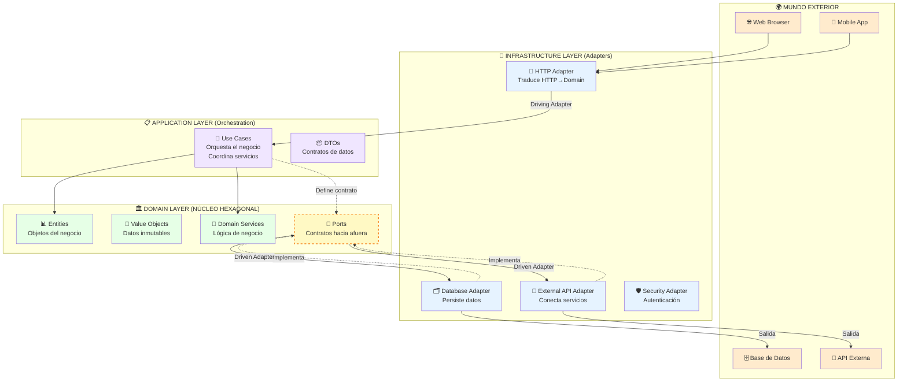
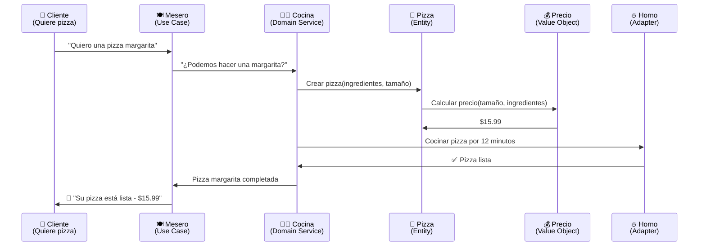
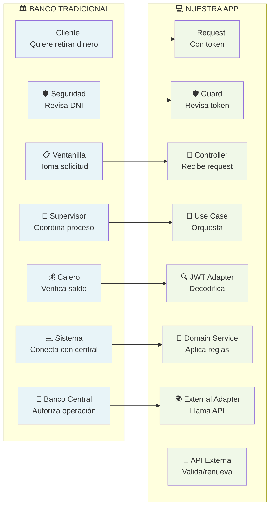
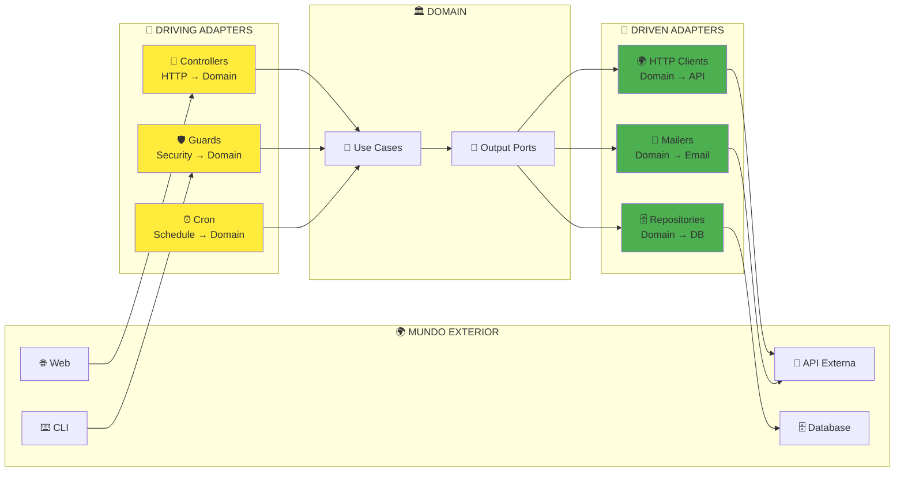
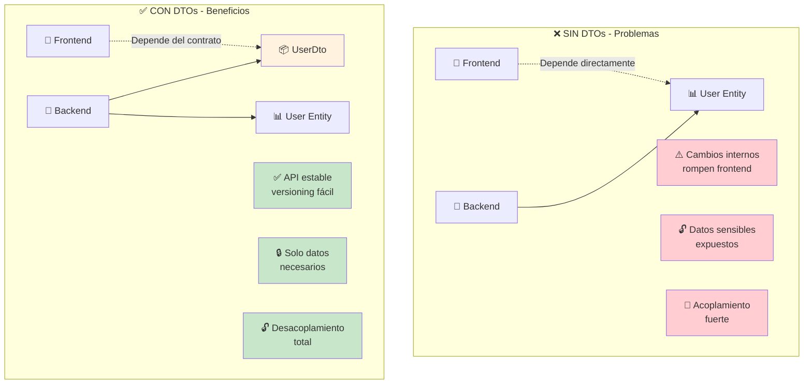

# 🏛️ Arquitectura Hexagonal con NestJS - Guía Completa desde Cero

**Aprende arquitectura de software profesional con ejemplos de la vida real**

---

## 📚 Tabla de Contenidos

1. [¿Qué es la Arquitectura Hexagonal?](#-qué-es-la-arquitectura-hexagonal)
2. [Domain-Driven Design (DDD)](#-domain-driven-design-ddd)
3. [Términos y Conceptos Clave](#-términos-y-conceptos-clave)
4. [Flujo de la Aplicación](#-flujo-de-la-aplicación)
5. [Explicación de Todos los Archivos](#-explicación-de-todos-los-archivos)
6. [Ejemplos de la Vida Real](#-ejemplos-de-la-vida-real)

---

## 🏛️ ¿Qué es la Arquitectura Hexagonal?

### 🔍 **Definición Simple**
La **Arquitectura Hexagonal** (también llamada "Ports and Adapters") es como organizar una empresa donde:
- **El núcleo del negocio** está en el centro (las reglas importantes)
- **Los departamentos externos** se conectan por "puertos" estandarizados
- **Cada departamento** puede ser reemplazado sin afectar el núcleo

### 🏗️ **Gráfico de Arquitectura Hexagonal**



### 🔑 **Conceptos Clave de la Arquitectura Hexagonal**

#### 🎯 **Driving Adapters (Adapters que Conducen)**
- **¿Qué son?** Adapters que **inician** acciones en el dominio
- **Ejemplos:** HTTP Controllers, CLI Commands, Message Consumers
- **Flujo:** Mundo exterior → Driving Adapter → Use Case

#### 🔄 **Driven Adapters (Adapters Conducidos)**
- **¿Qué son?** Adapters que son **utilizados** por el dominio
- **Ejemplos:** Database Repositories, External APIs, Email Services  
- **Flujo:** Use Case → Port → Driven Adapter → Mundo exterior

#### 🔌 **Principio de Inversión de Dependencias**
- **El dominio define QUÉ necesita** (Ports/Interfaces)
- **La infraestructura provee CÓMO hacerlo** (Adapters/Implementaciones)
- **El dominio NO conoce detalles técnicos** (no sabe de HTTP, DB, etc.)

### ✅ **Ventajas**

| Ventaja | Explicación | Ejemplo de la Vida Real |
|---------|-------------|------------------------|
| **🔄 Intercambiabilidad** | Cambias una parte sin afectar el resto | Cambiar de iPhone a Android - tus contactos siguen igual |
| **🧪 Testeable** | Pruebas cada parte por separado | Probar el motor de un auto sin necesidad del auto completo |
| **📈 Escalable** | Crece fácil cuando necesitas más | Agregar más empleados a una empresa bien organizada |
| **🔧 Mantenible** | Cada cosa tiene su lugar específico | Una casa donde cada cuarto tiene su propósito |
| **👥 Trabajo en equipo** | Varios desarrolladores pueden trabajar sin pisarse | Varios chefs en una cocina - cada uno en su estación |

### ❌ **Desventajas**

| Desventaja | Explicación | Ejemplo de la Vida Real |
|------------|-------------|------------------------|
| **📚 Complejidad inicial** | Más difícil de aprender al principio | Aprender a manejar - al principio parece imposible |
| **🏗️ Más archivos** | Muchos archivos para proyectos simples | Usar una empresa para vender limonada en la esquina |
| **⏰ Tiempo de desarrollo** | Tarda más en hacer cosas simples | Vestirse de gala para ir al supermercado |
| **🎓 Curva de aprendizaje** | Los juniors pueden confundirse | Un niño tratando de entender cómo funciona un banco |

---

## 🎯 Domain-Driven Design (DDD)

### 🔍 **¿Qué es DDD?**
**Domain-Driven Design** es como organizar una empresa enfocándose en **LO QUE HACE** la empresa, no en la tecnología que usa.

### 🏢 **Ejemplo: Pizzería vs. Software**

| Pizzería 🍕 | Software 💻 |
|-------------|-------------|
| **Cocina** (hace las pizzas) | **Domain** (reglas de negocio) |
| **Meseros** (toman pedidos) | **Application** (casos de uso) |
| **Caja registradora** (cobra) | **Infrastructure** (base de datos) |
| **Repartidores** (entregan) | **Controllers** (API endpoints) |

### 🧩 **Componentes de DDD**

#### 📊 **Entities (Entidades)**
```typescript
// Como una PERSONA - tiene identidad única
class Usuario {
  constructor(
    private id: string,      // 🆔 Su DNI - único e irrepetible
    private nombre: string,  // 📝 Puede cambiar de nombre
    private email: string    // 📧 Puede cambiar de email
  ) {}
  
  // 🔧 Comportamientos que PUEDE hacer una persona
  cambiarEmail(nuevoEmail: string) { /* ... */ }
  verificarIdentidad() { /* ... */ }
}
```

#### 💎 **Value Objects (Objetos de Valor)**
```typescript
// Como DINERO - se identifica por su valor
class Precio {
  constructor(
    private readonly monto: number,  // 💰 $100 siempre es $100
    private readonly moneda: string  // 🌍 USD, EUR, ARS
  ) {}
  
  // ✅ Dos precios de $100 USD son IGUALES
  equals(otro: Precio): boolean {
    return this.monto === otro.monto && this.moneda === otro.moneda;
  }
}
```

#### 🔧 **Domain Services (Servicios de Dominio)**
```typescript
// Como las REGLAS de un juego - no pertenecen a un jugador específico
class ValidadorDeCredito {
  // 📋 "Para aprobar un préstamo, el salario debe ser 3x la cuota"
  puedeAprobarPrestamo(usuario: Usuario, prestamo: Prestamo): boolean {
    return usuario.salario >= (prestamo.cuota * 3);
  }
}
```

### 🔄 **Flujo DDD con Ejemplo**



---

## 🎓 Términos y Conceptos Clave

### 🔌 **Puerto (Port)**
**¿Qué es?** Una **interface/contrato** que define QUÉ necesitas hacer, pero NO cómo hacerlo.

**Ejemplo de la vida:** El enchufe de tu pared
- ✅ Define QUÉ: "Necesito electricidad de 220V"
- ❌ NO define CÓMO: No le importa si viene de paneles solares, centrales eléctricas, etc.

```typescript
// 🔌 PUERTO - Solo define QUÉ necesito
interface IEnviarEmail {
  enviar(destinatario: string, mensaje: string): Promise<boolean>;
}

// ✅ Puedo usar Gmail
class GmailAdapter implements IEnviarEmail { /* ... */ }

// ✅ O cambiar a Outlook sin problemas
class OutlookAdapter implements IEnviarEmail { /* ... */ }
```

### 🔧 **Adaptador (Adapter)**
**¿Qué es?** La implementación CONCRETA que cumple el contrato del puerto.

**Ejemplo de la vida:** Adaptadores de enchufes para viajar
- Tu teléfono (dominio) siempre necesita electricidad (puerto)
- Pero en Europa usan enchufes diferentes (adapter diferente)
- Tu teléfono funciona igual en ambos lados

### 🛡️ **Guard (Guardia)**
**¿Qué es?** Un **portero/seguridad** que decide quién puede pasar.

**Ejemplo de la vida:** Portero de un edificio
```typescript
// 🛡️ Como un portero que revisa tu credencial
@Injectable()
export class TokenValidationGuard {
  canActivate(): boolean {
    // 🔍 "¿Tenés pase válido?"
    if (!tieneTokenValido()) {
      // ❌ "No podés pasar"
      throw new Error("Acceso denegado");
    }
    // ✅ "Adelante, podés subir"
    return true;
  }
}
```

### 💉 **Inyección de Dependencias**
**¿Qué es?** En lugar de que cada clase "busque" lo que necesita, se lo **das hecho**.

**Ejemplo de la vida:** Restaurante vs. Casa
```typescript
// ❌ MALO - Cocinar en casa (tú buscas todo)
class Cocinero {
  cocinar() {
    const ingredientes = this.irAlSupermercado();  // 🏪 Vas al super
    const utensilios = this.lavarPlatos();         // 🧽 Lavas platos
    const comida = this.preparar(ingredientes);     // 🍳 Cocinas
  }
}

// ✅ BUENO - Restaurante (te traen todo preparado)
class Chef {
  constructor(
    private ingredientes: Ingredientes,  // 📦 Ya los tienes listos
    private utensilios: Utensilios      // 🍴 Ya están limpios
  ) {}
  
  cocinar() {
    return this.preparar(this.ingredientes);  // 🎯 Solo te enfocas en cocinar
  }
}
```

### 🎯 **Use Case (Caso de Uso)**
**¿Qué es?** Una **función específica** que tu aplicación puede hacer.

**Ejemplo de la vida:** Cajero automático
- "Retirar dinero" = 1 use case
- "Consultar saldo" = 1 use case  
- "Transferir dinero" = 1 use case

### 📦 **DTO (Data Transfer Object)**
**¿Qué es?** Un **sobre/paquete** que transporta información entre diferentes partes.

**Ejemplo de la vida:** Paquete de correo
```typescript
// 📦 Como un paquete - solo transporta datos
class PaqueteDTO {
  constructor(
    public readonly destinatario: string,  // 📮 A quién va
    public readonly remitente: string,     // 📤 De quién viene  
    public readonly contenido: string      // 📄 Qué lleva adentro
  ) {}
  // ❌ No hace nada más - solo transporta
}
```

### 🎭 **Decorator**
**¿Qué es?** Etiquetas que le dicen a NestJS qué hacer con una clase/método.

**Ejemplo de la vida:** Etiquetas en la ropa
```typescript
// 🎭 Como etiquetas que dan instrucciones
@Controller()      // 🏷️ "Esta clase maneja HTTP"
@Get()            // 🏷️ "Este método responde a GET"
@UseGuards()      // 🏷️ "Revisar seguridad antes"
export class MiController {
  @Post()         // 🏷️ "Este método responde a POST"
  crear() { /* ... */ }
}
```

### 🔥 **Exception (Excepción)**
**¿Qué es?** Una forma elegante de decir "algo salió mal".

**Ejemplo de la vida:** Alarmas de tu casa
```typescript
// 🚨 Como diferentes alarmas para diferentes problemas
class TokenExpiradoException extends Error {
  constructor() {
    super("Tu sesión expiró - necesitas loguearte de nuevo");
  }
}

class TokenInvalidoException extends Error {
  constructor() {
    super("Ese token no es válido");
  }
}
```

---

## 🌊 Flujo de la Aplicación

### 📱 **Flujo Completo: "Cliente quiere validar su token"**

```mermaid
graph TD
    %% Inicio
    START[👤 Usuario abre la app<br/>Token guardado: eyJhbGciOiJIUzI1NiIs...] 
    
    %% Infrastructure - Entrada
    subgraph "🔧 INFRASTRUCTURE - Driving Adapters"
        REQ[📱 HTTP Request<br/>GET /api<br/>Authorization: Bearer token123]
        GUARD[🛡️ TokenValidationGuard<br/>Security Adapter<br/>Extrae header Authorization]
        CTRL[📡 AuthController<br/>HTTP Adapter<br/>Traduce HTTP → Domain]
    end
    
    %% Application
    subgraph "📋 APPLICATION - Orchestration"
        UC[🎯 ValidateTokenUseCase<br/>Application Service<br/>Orquesta validación completa]
        UDTO[👤 UserInfoDto<br/>Data Transfer Object<br/>Info segura del usuario]
        RDTO[📦 TokenValidationResponseDto<br/>Response DTO<br/>Empaqueta respuesta final]
    end
    
    %% Domain - Núcleo con TODOS los componentes
    subgraph "🏛️ DOMAIN - Business Core"
        %% Entities
        ENT[📊 Token Entity<br/>Identidad: Credencial única<br/>Comportamientos: isExpired()]
        
        %% Value Objects  
        VO[💎 JwtPayload Value Object<br/>Inmutable: sub, username, exp, iss<br/>Métodos: isExpired(), toString()]
        
        %% Domain Services
        DS[🔧 TokenValidationDomainService<br/>Reglas de Negocio<br/>validateTokenBusinessRules()]
        
        %% Ports (Interfaces)
        PORT1[🔌 ITokenRepository<br/>Output Port<br/>validateToken(): Token]
        PORT2[🔌 IExternalTokenRepository<br/>Output Port<br/>validateAndRenewToken(): string]
        PORTLOG[🔌 ILoggerPort<br/>Output Port<br/>log(), error(), warn()]
        
        %% Domain Exceptions
        EXC1[❌ TokenExpiredException<br/>Domain Exception<br/>code: TOKEN_EXPIRED]
        EXC2[❌ InvalidTokenException<br/>Domain Exception<br/>code: INVALID_TOKEN]
        EXC3[❌ MissingTokenException<br/>Domain Exception<br/>code: MISSING_TOKEN]
        EXC4[❌ UpstreamHttpException<br/>Domain Exception<br/>code: UPSTREAM_HTTP_ERROR]
    end
    
    %% Infrastructure - Adapters de Salida
    subgraph "🔧 INFRASTRUCTURE - Driven Adapters"
        JWT[🔍 JwtAdapter<br/>Token Validation Adapter<br/>Implementa: ITokenRepository<br/>jwt.decode() sin verificar firma]
        EXT[🌍 TokenValidationAdapter<br/>External API Adapter<br/>Implementa: IExternalTokenRepository<br/>Conecta con Auth0/Keycloak]
        LOG[📝 ConsoleLoggerAdapter<br/>Logger Adapter<br/>Implementa: ILoggerPort<br/>console.log(), console.error()]
        API[🏢 API Externa<br/>Auth Service<br/>POST /validate-token<br/>Response: renewedToken]
    end
    
    %% Shared Infrastructure
    subgraph "🛡️ SHARED INFRASTRUCTURE - Error Handling"
        FILTER[🛡️ DomainExceptionFilter<br/>Exception Filter<br/>DomainException → HTTP Response]
        BASEEXC[❌ DomainException<br/>Base Exception<br/>abstract class con code]
    end
    
    %% Response
    subgraph "📤 HTTP RESPONSE"
        SUCCESS[✅ 200 OK<br/>{"message": "Validación exitosa",<br/>"user": {"sub": "123", "username": "juan"},<br/>"validatedToken": "renewed_abc..."}]
        ERROR[❌ 401/503 Error<br/>{"error": true, "statusCode": 401,<br/>"errorCode": "TOKEN_EXPIRED",<br/>"message": "El token ha expirado"}]
    end
    
    %% FLUJO PRINCIPAL
    START --> REQ
    REQ --> GUARD
    GUARD -->|✅ Header presente| CTRL
    GUARD -->|❌ Header faltante| EXC3
    
    CTRL --> UC
    
    %% Use Case usa Ports (Inversión de Dependencias)
    UC -.->|Depende de| PORT1
    UC -.->|Depende de| PORT2  
    UC -.->|Depende de| PORTLOG
    
    %% Adapters implementan Ports
    JWT -.->|Implementa| PORT1
    EXT -.->|Implementa| PORT2
    LOG -.->|Implementa| PORTLOG
    
    %% Flujo de validación
    UC -->|Llama via Port1| JWT
    JWT -->|Crea| VO
    VO -->|Se encapsula en| ENT
    JWT -->|Retorna| ENT
    
    UC -->|Usa| DS
    DS -->|Valida| ENT
    DS -->|Si expirado| EXC1
    DS -->|Si claims inválidos| EXC2
    
    UC -->|Llama via Port2| EXT
    EXT -->|HTTP Call| API
    API -->|Response| EXT
    EXT -->|Error API| EXC4
    
    %% Construcción de respuesta
    UC -->|Crea| UDTO
    UC -->|Crea| RDTO
    RDTO --> SUCCESS
    
    %% Manejo de errores
    EXC1 --> BASEEXC
    EXC2 --> BASEEXC  
    EXC3 --> BASEEXC
    EXC4 --> BASEEXC
    BASEEXC --> FILTER
    FILTER --> ERROR
    
    %% Estilos
    classDef start fill:#e1f5fe
    classDef infrastructure fill:#fff3e0
    classDef application fill:#f3e5f5
    classDef domain fill:#e8f5e8
    classDef entity fill:#c8e6c9
    classDef valueobject fill:#e1bee7
    classDef domainservice fill:#ffccbc
    classDef port fill:#fff9c4,stroke:#f57f17,stroke-width:2px,stroke-dasharray: 5 5
    classDef exception fill:#ffcdd2
    classDef adapter fill:#e3f2fd
    classDef response fill:#f1f8e9
    classDef error fill:#ffebee
    
    class START start
    class REQ,GUARD,CTRL infrastructure
    class UC application
    class UDTO,RDTO application
    class ENT entity
    class VO valueobject  
    class DS domainservice
    class PORT1,PORT2,PORTLOG port
    class EXC1,EXC2,EXC3,EXC4,BASEEXC exception
    class JWT,EXT,LOG,API adapter
    class FILTER infrastructure
    class SUCCESS,ERROR response
```

### 🔄 **Explicación Paso a Paso con TODOS los Componentes**

| Paso | Capa | Archivo/Componente | Tipo | ¿Qué hace? | Ejemplo de la vida |
|------|------|--------------------|------|------------|-------------------|
| 1 | 🌍 | Frontend | Cliente | Envía request con token | Cliente muestra DNI en la entrada |
| 2 | 🔧 | `token-validation.guard.ts` | **Security Adapter** | Intercepta y verifica headers | Portero revisa que traigas credencial |
| 3 | 🔧 | `auth.controller.ts` | **Driving Adapter** | Traduce HTTP a dominio | Traductor convierte idiomas |
| 4 | 📋 | `validate-token.use-case.ts` | **Application Service** | Orquesta todo el proceso | Gerente coordina validación |
| 5a | 🔌 | `token-validation.port.ts` | **Puerto de Salida** | Define contrato para JWT | "Necesito leer credenciales" |
| 5b | 🔧 | `jwt.adapter.ts` | **Driven Adapter** | Implementa lectura JWT | Máquina lectora de DNIs |
| 6 | 💎 | `jwt-payload.value-object.ts` | **Value Object** | Datos inmutables extraídos | Datos impresos en tu DNI |
| 7 | 📊 | `token.entity.ts` | **Entity** | Objeto con identidad única | Tu "ficha personal" completa |
| 8 | 🔧 | `token-validation.domain-service.ts` | **Domain Service** | Aplica reglas de negocio | Inspector aplica reglamento |
| 9a | 🔌 | `external-token-validation.port.ts` | **Puerto de Salida** | Define contrato para API externa | "Necesito verificar con central" |
| 9b | 🔧 | `token-validation.adapter.ts` | **Driven Adapter** | Conecta con API externa | Teléfono para llamar a policía |
| 10 | 🏢 | API Externa | Sistema Externo | Valida y renueva token | Base de datos policial |
| 11 | 📦 | `token-validation-response.dto.ts` | **DTO** | Empaqueta respuesta | Certificado oficial armado |
| 12 | 🔧 | `auth.controller.ts` | **Driving Adapter** | Convierte respuesta a HTTP | Traductor devuelve en tu idioma |
| 13 | 🌍 | Frontend | Cliente | Recibe respuesta JSON | Recibes tu pase de entrada |

### 📋 **Flujo de Errores con Componentes Específicos**

| Error | Capa | Archivo/Componente | Tipo | ¿Qué hace? | Resultado HTTP |
|-------|------|--------------------|------|------------|----------------|
| Token faltante | 🔧 | `token-validation.guard.ts` | **Security Adapter** | Detecta header vacío | 401 Unauthorized |
| Token malformado | 🔧 | `jwt.adapter.ts` | **Driven Adapter** | No puede decodificar | `InvalidTokenException` |
| Token expirado | 📊 | `token.entity.ts` | **Entity** | Revisa fecha vencimiento | `TokenExpiredException` |
| Reglas fallidas | 🔧 | `token-validation.domain-service.ts` | **Domain Service** | Claims inválidos | `InvalidTokenClaimsException` |
| API externa caída | 🔧 | `token-validation.adapter.ts` | **Driven Adapter** | Error HTTP 503 | `UpstreamHttpException` |
| Traducción a HTTP | 🔧 | `domain-exception.filter.ts` | **Exception Filter** | Convierte a JSON | Response HTTP final |

---

## 📁 Explicación de Todos los Archivos

### 🏗️ **Estructura del Proyecto**

```
src/
├── 📄 main.ts                                    # 🚀 Arranca toda la aplicación
├── 📄 app.module.ts                              # 🏢 Oficina principal - coordina todo
├── 📁 shared/                                    # 🌍 Recursos compartidos
│   ├── 📁 domain/
│   │   ├── 📁 exceptions/
│   │   │   └── 📄 domain.exception.ts            # ❌ Clase base de errores
│   │   └── 📁 ports/
│   │       └── 📄 logger.port.ts                 # 🔌 Contrato para logging
│   └── 📁 infrastructure/
│       ├── 📁 adapters/
│       │   └── 📄 console-logger.adapter.ts      # 🖨️ Imprime logs en consola
│       └── 📁 filters/
│           └── 📄 domain-exception.filter.ts     # 🛡️ Convierte errores a JSON
└── 📁 modules/auth/                              # 🔐 Módulo de autenticación
    ├── 📄 auth.module.ts                         # ⚙️ Configuración del módulo
    ├── 📁 domain/                                # 🏛️ NÚCLEO - Reglas de negocio
    │   ├── 📁 entities/
    │   │   └── 📄 token.entity.ts                # 📊 Representa un token
    │   ├── 📁 value-objects/
    │   │   └── 📄 jwt-payload.value-object.ts    # 💎 Datos del JWT
    │   ├── 📁 services/
    │   │   └── 📄 token-validation.domain-service.ts # 🔧 Reglas de validación
    │   ├── 📁 exceptions/
    │   │   └── 📄 token.exception.ts             # ❌ Errores específicos
    │   └── 📁 ports/
    │       ├── 📄 token-validation.port.ts       # 🔌 Contrato validación local
    │       └── 📄 external-token-validation.port.ts # 🔌 Contrato validación externa
    ├── 📁 application/                           # 📋 CASOS DE USO
    │   ├── 📁 use-cases/
    │   │   └── 📄 validate-token.use-case.ts     # 🎯 Proceso de validación
    │   └── 📁 dtos/
    │       └── 📄 token-validation-response.dto.ts # 📦 Formato de respuesta
    └── 📁 infrastructure/                        # 🔧 CONEXIONES EXTERNAS
        ├── 📁 controllers/
        │   └── 📄 auth.controller.ts             # 📡 Maneja requests HTTP
        ├── 📁 adapters/
        │   ├── 📄 jwt.adapter.ts                 # 🔍 Decodifica JWT
        │   └── 📄 token-validation.adapter.ts    # 🌍 Conecta API externa
        └── 📁 guards/
            └── 📄 token-validation.guard.ts      # 🛡️ Seguridad de entrada
```

---

### 📋 **Explicación Archivo por Archivo**

#### 🚀 **main.ts** - El Interruptor Principal
```typescript
// 🔌 Como el interruptor principal de tu casa
async function bootstrap() {
  const app = await NestJS.create(AppModule);
  await app.listen(3000);  // 🏠 "Abre la casa en la dirección 3000"
}
```
**¿Qué hace?** Prende toda la aplicación, como cuando prendes la luz de tu casa.

---

#### 🏢 **app.module.ts** - La Oficina Principal  
```typescript
@Module({
  imports: [AuthModule],        // 📁 "Importa el departamento de seguridad"
  providers: [GlobalFilters]    // 🛡️ "Configura la seguridad global"
})
export class AppModule {}
```
**¿Qué hace?** Como la gerencia general que coordina todos los departamentos.

**Ejemplo de la vida:** La oficina principal de un banco que coordina:
- Departamento de préstamos ✅
- Departamento de seguridad ✅  
- Departamento de atención al cliente ✅

---

#### 🔐 **auth.module.ts** - Departamento de Seguridad
```typescript
@Module({
  controllers: [AuthController],      // 📡 "Recepcionistas de seguridad"
  providers: [
    ValidateTokenUseCase,            // 🎯 "Proceso de validación"
    TokenValidationDomainService,    // 🔧 "Experto en reglas"
    { provide: 'TokenPort', useClass: JwtAdapter }  // 🔌 "Usa JWT para validar"
  ]
})
```
**¿Qué hace?** Configura todo el departamento de seguridad de la empresa.

**Ejemplo de la vida:** El jefe de seguridad que define:
- Quiénes son los porteros (controllers) 👮‍♂️
- Qué procedimientos seguir (use cases) 📋
- Qué herramientas usar (adapters) 🔧

---

### 🏛️ **DOMAIN LAYER** - El Corazón del Negocio

#### 📊 **token.entity.ts** - La Credencial
```typescript
export class Token {
  constructor(private payload: JwtPayload) {}
  
  // 🔍 "¿Sigo siendo válido?"
  isExpired(): boolean {
    return this.payload.isExpired();
  }
  
  // 👤 "¿Quién soy?"  
  get username(): string {
    return this.payload.username;
  }
}
```
**¿Qué hace?** Representa una credencial/pase de acceso.

**Ejemplo de la vida:** Tu DNI
- Tiene tu información personal ✅
- Puede verificar si está vencido ✅
- Te identifica de forma única ✅

---

#### 💎 **jwt-payload.value-object.ts** - Los Datos del DNI
```typescript
export class JwtPayload {
  constructor(
    public readonly sub: string,      // 🆔 Tu número de documento
    public readonly username: string, // 👤 Tu nombre
    public readonly exp: number,      // ⏰ Fecha de vencimiento
    public readonly iss: string       // 🏢 Quién lo emitió
  ) {}
  
  // ⏰ "¿Ya estoy vencido?"
  isExpired(): boolean {
    return Date.now() > this.exp;
  }
}
```
**¿Qué hace?** Guarda todos los datos que vienen en el token.

**Ejemplo de la vida:** La información impresa en tu DNI
- Número de documento: `12345678`
- Nombre completo: `Juan Pérez`  
- Fecha de vencimiento: `2030-12-31`
- Emitido por: `RENAPER`

---

#### 🔧 **token-validation.domain-service.ts** - El Experto en Reglas
```typescript
export class TokenValidationDomainService {
  // 📋 "¿Este token cumple TODAS nuestras reglas?"
  validateTokenBusinessRules(token: Token): boolean {
    
    // 🚨 Regla 1: No debe estar vencido
    if (token.isExpired()) {
      throw new TokenExpiredException();
    }
    
    // 🚨 Regla 2: Debe tener datos válidos
    if (!token.username || token.username === '') {
      throw new InvalidTokenException();
    }
    
    return true; // ✅ ¡Pasó todas las reglas!
  }
}
```
**¿Qué hace?** Aplica todas las reglas de negocio para validar tokens.

**Ejemplo de la vida:** El inspector de documentos en el aeropuerto
- ✅ Verifica que no esté vencido
- ✅ Verifica que los datos sean legibles  
- ✅ Verifica que sea auténtico
- ❌ Si algo falla, no te deja pasar

---

#### ❌ **token.exception.ts** - Los Tipos de Errores
```typescript
// 🚨 "Tu DNI está vencido"
export class TokenExpiredException extends DomainException {
  readonly code = 'TOKEN_EXPIRED';
  constructor() {
    super('El token ha expirado');
  }
}

// 🚨 "Este DNI es falso"
export class InvalidTokenException extends DomainException {
  readonly code = 'INVALID_TOKEN';
  constructor() {
    super('Token inválido');
  }
}
```
**¿Qué hace?** Define todos los tipos de errores que pueden ocurrir.

**Ejemplo de la vida:** Los motivos por los que no te dejan entrar:
- "Tu DNI está vencido" 📅
- "Este DNI es falso" 🚫
- "No trajiste DNI" ❓
- "Falta una página" 📄

---

#### 🔌 **Puertos (Interfaces)**

**token-validation.port.ts** - "Necesito validar tokens localmente"
```typescript
export interface ITokenRepository {
  // 🔍 "Dame un token, te digo si es válido"
  validateToken(tokenValue: string): Promise<Token | null>;
}
```

**external-token-validation.port.ts** - "Necesito validar con sistema externo"
```typescript
export interface IExternalTokenRepository {
  // 🌍 "Valida este token con el sistema autoritativo"
  validateAndRenewToken(token: string): Promise<string>;
}
```

**¿Qué hacen?** Definen QUÉ necesita el dominio, pero NO cómo hacerlo.

**Ejemplo de la vida:** Los requisitos para un trabajo
- "Necesito a alguien que sepa manejar" (puerto) 🚗
- No importa si maneja manual o automático (implementación) ⚙️
- Lo importante es que pueda llevar el camión de A a B 📍

---

### 📋 **APPLICATION LAYER** - Los Procesos

#### 🎯 **validate-token.use-case.ts** - El Proceso Completo
```typescript
export class ValidateTokenUseCase {
  async execute(tokenValue: string): Promise<TokenValidationResponseDto> {
    // 1️⃣ "¿Trajiste token?"
    if (!tokenValue) {
      throw new MissingTokenException();
    }
    
    // 2️⃣ "Déjame leer tu token"
    const token = await this.tokenValidationPort.validateToken(tokenValue);
    
    // 3️⃣ "¿Cumple nuestras reglas?"
    this.domainService.validateTokenBusinessRules(token);
    
    // 4️⃣ "Confirmemos con el sistema central"
    const renewedToken = await this.externalPort.validateAndRenewToken(tokenValue);
    
    // 5️⃣ "¡Todo bien! Aquí tienes tu pase renovado"
    return new TokenValidationResponseDto(
      'Validación exitosa',
      new UserInfoDto(token.sub, token.username),
      renewedToken
    );
  }
}
```
**¿Qué hace?** Coordina todo el proceso de validación paso a paso.

**Ejemplo de la vida:** El proceso completo en el aeropuerto
1. "¿Trajiste tu pasaporte?" ✈️
2. "Déjame revisarlo" 👀
3. "¿Cumple todos los requisitos?" 📋
4. "Voy a confirmar con el sistema" 💻
5. "¡Perfecto! Aquí está tu boarding pass" 🎫

---

#### 📦 **token-validation-response.dto.ts** - El Paquete de Respuesta
```typescript
// 📦 El "sobre" con la respuesta completa
export class TokenValidationResponseDto {
  constructor(
    public readonly message: string,        // 💬 "¡Validación exitosa!"
    public readonly user: UserInfoDto,      // 👤 Info del usuario
    public readonly validatedToken: string  // 🔑 Token renovado
  ) {}
}

// 👤 Info básica del usuario (sin datos sensibles)
export class UserInfoDto {
  constructor(
    public readonly sub: string,       // 🆔 ID del usuario
    public readonly username: string,  // 👤 Nombre de usuario  
    public readonly validated: boolean = true  // ✅ Confirmación
  ) {}
}
```
**¿Qué hace?** Empaqueta toda la información para enviar al frontend.

**Ejemplo de la vida:** El paquete que te dan después del trámite
- 📄 Certificado oficial: "Trámite aprobado"
- 🆔 Tu información: "Juan Pérez, DNI 12345678"
- 🔑 Tu nuevo documento: "Válido hasta 2030"

---

### 🔧 **INFRASTRUCTURE LAYER** - Las Conexiones

#### 📡 **auth.controller.ts** - El Driving Adapter HTTP
```typescript
@Controller()
export class AuthController {
  
  @Get()  // 🌐 "Respondo a pedidos GET"
  @UseGuards(TokenValidationGuard)  // 🛡️ "Primero pasa por seguridad"
  async validateToken(@Req() req: RequestWithTokenData): Promise<TokenValidationResponseDto> {
    
    // 🎯 "Traduzco HTTP a llamada de dominio"
    return await this.validateTokenUseCase.execute(req.tokenValue);
  }
}
```
**¿Qué hace?** **Driving Adapter** que traduce requests HTTP en llamadas al dominio.

**Ejemplo de la vida:** El traductor en la embajada
- Recibe solicitudes en un idioma (HTTP) 🌐
- Las traduce al idioma interno del país (dominio) 🏛️
- Envía la respuesta traducida de vuelta 📤
- NO toma decisiones - solo traduce protocolos 🔄

**Arquitectura Hexagonal:** Este Controller es un **Adapter de entrada** que permite al mundo exterior (HTTP) comunicarse con el núcleo del dominio. Es parte de la capa Infrastructure y NO contiene lógica de negocio - solo traduce entre protocolos.

---

#### 🛡️ **token-validation.guard.ts** - El Portero
```typescript
export class TokenValidationGuard implements CanActivate {
  async canActivate(context: ExecutionContext): Promise<boolean> {
    const request = context.switchToHttp().getRequest();
    
    // 🔍 "¿Trajiste tu credencial?"
    const token = this.extractTokenFromHeader(request);
    
    if (!token) {
      // ❌ "Sin credencial no pasas"
      throw new MissingTokenException();
    }
    
    // ✅ "OK, podés pasar - pero guardo tu credencial para después"
    request.tokenValue = token;
    return true;
  }
}
```
**¿Qué hace?** Primera línea de seguridad - revisa que tengas credenciales.

**Ejemplo de la vida:** El portero del edificio
- "¿Tenés la llave/tarjeta de acceso?" 🔑
- Si no la tenés: "No podés entrar" ❌
- Si la tenés: "Adelante, que tengas buen día" ✅
- Anota en el registro que entraste 📝

---

#### 🔍 **jwt.adapter.ts** - El Decodificador
```typescript
export class JwtAdapter implements ITokenRepository {
  async validateToken(tokenValue: string): Promise<Token | null> {
    try {
      // 🧹 "Limpio el token (saco el 'Bearer ')"
      const cleanToken = this.extractBearerToken(tokenValue);
      
      // 🔍 "Decodifico el JWT para leer su contenido"
      const decoded = jwt.decode(cleanToken);
      
      // ✅ "Creo los objetos de dominio"
      const payload = JwtPayload.fromDecodedToken(decoded);
      return new Token(payload);
      
    } catch (error) {
      // ❌ "Si algo falla, el token es inválido"
      throw new InvalidTokenException();
    }
  }
}
```
**¿Qué hace?** Lee y decodifica tokens JWT para extraer la información.

**Ejemplo de la vida:** El experto en documentos que examina tu DNI
- Sabe leer los códigos especiales 🔍
- Extrae toda tu información personal 📄
- Detecta si es falso o está dañado ❌
- Te dice qué datos contiene ✅

---

#### 🌍 **token-validation.adapter.ts** - El Verificador Externo
```typescript
export class TokenValidationAdapter implements IExternalTokenRepository {
  async validateAndRenewToken(originalToken: string): Promise<string> {
    
    // 🎲 Simula errores aleatorios (10% del tiempo)
    if (Math.random() < 0.1) {
      throw new UpstreamHttpException(401, 'Token inválido en sistema externo');
    }
    
    // ✅ Simula respuesta exitosa con token renovado
    const renewedToken = `renewed_${originalToken.substring(0, 20)}...${Date.now()}`;
    
    this.logger.log('Token validado exitosamente con API externa');
    return renewedToken;
    
    // 🔄 En producción sería algo como:
    // const response = await axios.post('https://auth-api.com/validate', {
    //   token: originalToken
    // });
    // return response.data.renewedToken;
  }
}
```
**¿Qué hace?** Conecta con sistemas externos para validación autoritativa.

**Ejemplo de la vida:** Llamar a la comisaría para verificar si un DNI es real
- "Hola, necesito verificar el DNI 12345678" ☎️
- Comisaría: "Sí, es válido y pertenece a Juan Pérez" ✅
- O: "No, ese DNI está reportado como robado" ❌

---

### 🛡️ **Manejo de Errores**

#### 🚨 **domain-exception.filter.ts** - El Traductor de Errores
```typescript
@Catch(DomainException)
export class DomainExceptionFilter implements ExceptionFilter {
  catch(exception: DomainException, host: ArgumentsHost) {
    const response = host.switchToHttp().getResponse();
    
    // 🔄 Convierte errores de dominio a respuestas HTTP
    const errorResponse = {
      error: true,
      statusCode: this.getStatusCode(exception),
      errorCode: exception.code,
      message: exception.message,
      timestamp: new Date().toISOString()
    };
    
    response.status(errorResponse.statusCode).json(errorResponse);
  }
}
```
**¿Qué hace?** Convierte errores internos en respuestas HTTP entendibles.

**Ejemplo de la vida:** El traductor en el aeropuerto
- Error interno: `TokenExpiredException` ❌
- Se convierte en: "Su pasaporte está vencido, necesita renovarlo" 🗣️
- Respuesta HTTP: `401 Unauthorized` con mensaje claro 📱

---

## 🎭 Ejemplos de la Vida Real

### 🏪 **Ejemplo Completo: Ir al Supermercado**

| Paso del Super 🛒 | Paso de la App 💻 | Archivo Responsable |
|-------------------|-------------------|-------------------|
| 1. Llego al super con mi tarjeta | Frontend envía token | `auth.controller.ts` |
| 2. Portero revisa que tenga algo para pagar | Guard revisa Authorization header | `token-validation.guard.ts` |  
| 3. Entro y busco los productos | Controller deriva al Use Case | `validate-token.use-case.ts` |
| 4. Reviso que mi tarjeta no esté vencida | JWT Adapter decodifica token | `jwt.adapter.ts` |
| 5. Caja verifica reglas: ¿tengo saldo? | Domain Service aplica reglas | `token-validation.domain-service.ts` |
| 6. Llaman al banco para confirmar | External Adapter llama API | `token-validation.adapter.ts` |
| 7. Banco dice: "OK, pero renuevo la tarjeta" | API externa renueva token | API Externa |
| 8. Me dan ticket + nueva tarjeta | Se devuelve DTO con nuevo token | `token-validation-response.dto.ts` |

### 🏥 **Ejemplo: Hospital**

| Área del Hospital 🏥 | Equivalente en el Código 💻 | Rol en Arquitectura Hexagonal |
|---------------------|---------------------------|---------------------------|
| **Recepción** 📋 | `AuthController` | **Driving Adapter** - Punto de entrada |
| **Seguridad** 🛡️ | `TokenValidationGuard` | **Security Adapter** - Primera validación |
| **Coordinador Médico** 👨‍⚕️ | `ValidateTokenUseCase` | **Application Service** - Orquesta procesos |
| **Archivo de Historias** 📁 | `JwtAdapter` | **Driven Adapter** - Lee datos externos |
| **Doctor** 🩺 | `TokenValidationDomainService` | **Domain Service** - Aplica reglas de negocio |
| **Laboratorio Externo** 🧪 | `ExternalTokenValidationAdapter` | **Driven Adapter** - Conecta con servicios externos |
| **Alta/Receta** 📝 | `TokenValidationResponseDto` | **DTO** - Contrato de salida |

### 🏛️ **Ejemplo: Banco**



---

## 🎯 Conclusión

### ✅ **Lo que Aprendiste**

1. **🏛️ Arquitectura Hexagonal**: Como organizar software igual que una empresa bien estructurada
2. **🎯 DDD**: Enfocarse en las reglas del negocio, no en la tecnología
3. **🔧 Patrones**: Herramientas que usan los desarrolladores profesionales
4. **📚 Términos**: El "idioma" que necesitas para trabajar en equipos

### 🚀 **Siguientes Pasos**

1. **Ejecuta el proyecto** y haz requests para ver cómo funciona
2. **Modifica un archivo** y observa cómo afecta al resto
3. **Agrega nuevas funcionalidades** siguiendo la misma estructura
4. **Practica explicando** los conceptos con tus propios ejemplos

### 💡 **Recuerda**

> **"La arquitectura no es sobre la tecnología, es sobre organizar ideas"**

Igual que una ciudad bien planificada hace la vida más fácil, un código bien arquitecturado hace el desarrollo más simple, rápido y confiable.

---

**¡Ahora ya sabés cómo funciona la arquitectura de software profesional! 🎉**

---

## 🏗️ Componentes Detallados de Arquitectura Hexagonal

### 📊 **ENTITIES (Entidades)** - Los Objetos del Negocio

#### ¿Qué son las Entities?
- **Objetos con IDENTIDAD única** que persiste en el tiempo
- **Contienen lógica de negocio** específica del objeto
- **Su identidad NO cambia** aunque cambien sus propiedades
- **Son mutables** pero su identidad permanece constante
- **Encapsulan comportamientos** del objeto de dominio

#### 🔍 **Ejemplo: Token Entity**

```typescript
// 📄 src/modules/auth/domain/entities/token.entity.ts

export class Token {
  constructor(private payload: JwtPayload) {}
  
  // 🆔 IDENTIDAD: Cada token es único por su payload.sub
  get id(): string {
    return this.payload.sub;
  }
  
  // 🔧 COMPORTAMIENTOS: Lógica que puede hacer un token
  isExpired(): boolean {
    return this.payload.isExpired();
  }
  
  get username(): string {
    return this.payload.username;
  }
  
  get sub(): string {
    return this.payload.sub;
  }
  
  // 📋 REGLA DE NEGOCIO: Un token es válido si no está expirado
  isValid(): boolean {
    return !this.isExpired();
  }
  
  // 🔄 COMPORTAMIENTO: Comparar tokens por identidad
  equals(other: Token): boolean {
    return this.id === other.id;
  }
}
```

#### 🌟 **Características de una Entity**
| Característica | Explicación | Ejemplo de la vida |
|----------------|-------------|-------------------|
| **🆔 Identidad única** | Cada entity tiene un ID que la distingue | Tu DNI - aunque cambies tu nombre, tu número de documento es único |
| **🔄 Mutable** | Puede cambiar sus propiedades | Puedes mudarte (cambiar dirección) pero seguís siendo vos |
| **🎯 Comportamientos** | Sabe qué puede hacer | Una persona sabe si está viva, su edad, si puede votar |
| **📋 Reglas de negocio** | Contiene lógica específica del objeto | Un auto sabe si está encendido, si tiene combustible |

---

### 💎 **VALUE OBJECTS (Objetos de Valor)** - Los Datos Inmutables

#### ¿Qué son los Value Objects?
- **Objetos sin identidad** que se identifican por su VALOR
- **Son completamente inmutables** (readonly)
- **Dos VOs con mismo valor son IGUALES**
- **Encapsulan validaciones** de formato/contenido
- **Representan conceptos simples** del dominio

#### 🔍 **Ejemplo: JwtPayload Value Object**

```typescript
// 📄 src/modules/auth/domain/value-objects/jwt-payload.value-object.ts

export class JwtPayload {
  constructor(
    public readonly sub: string,      // 🆔 ID del usuario
    public readonly username: string, // 👤 Nombre de usuario
    public readonly exp: number,      // ⏰ Timestamp de expiración
    public readonly iss: string       // 🏢 Emisor del token
  ) {
    this.validateStructure();
  }
  
  // ✅ FACTORY METHOD: Crear desde token decodificado
  static fromDecodedToken(decoded: any): JwtPayload {
    return new JwtPayload(
      decoded.sub,
      decoded.username,
      decoded.exp,
      decoded.iss
    );
  }
  
  // 🔍 VALIDACIÓN: Verificar estructura
  private validateStructure(): void {
    if (!this.sub) throw new InvalidTokenException('Missing sub claim');
    if (!this.username) throw new InvalidTokenException('Missing username claim');
    if (!this.exp || this.exp <= 0) throw new InvalidTokenException('Invalid exp claim');
    if (!this.iss) throw new InvalidTokenException('Missing iss claim');
  }
  
  // ⏰ COMPORTAMIENTO: ¿Está expirado?
  isExpired(): boolean {
    return Date.now() / 1000 > this.exp;
  }
  
  // 🔄 IGUALDAD: Dos payloads son iguales si tienen el mismo valor
  equals(other: JwtPayload): boolean {
    return (
      this.sub === other.sub &&
      this.username === other.username &&
      this.exp === other.exp &&
      this.iss === other.iss
    );
  }
  
  // 📄 REPRESENTACIÓN: Para logs y debugging
  toString(): string {
    return `JwtPayload(sub: ${this.sub}, username: ${this.username}, exp: ${new Date(this.exp * 1000).toISOString()})`;
  }
}
```

#### 🌟 **Características de un Value Object**
| Característica | Explicación | Ejemplo de la vida |
|----------------|-------------|-------------------|
| **💎 Sin identidad** | Se identifica por su valor, no por un ID | $100 es $100, no importa qué billete específico |
| **🔒 Inmutable** | No puede cambiar después de crearse | Una fecha: 25 de Mayo de 1810 es siempre esa fecha |
| **⚖️ Igualdad por valor** | Dos VOs iguales son intercambiables | Dos monedas de $1 son exactamente lo mismo |
| **✅ Auto-validación** | Se valida a sí mismo al crearse | Un email debe tener @ y formato correcto |

---

### 🔧 **DOMAIN SERVICES (Servicios de Dominio)** - La Lógica de Negocio

#### ¿Qué son los Domain Services?
- **Lógica de negocio** que NO pertenece a una Entity específica
- **Operaciones complejas** que involucran múltiples entidades
- **Reglas del dominio** que son procesos, no objetos
- **Stateless** - no guardan estado interno
- **Pura lógica de negocio** sin dependencias técnicas

#### 🔍 **Ejemplo: TokenValidationDomainService**

```typescript
// 📄 src/modules/auth/domain/services/token-validation.domain-service.ts

@Injectable()
export class TokenValidationDomainService {
  
  /**
   * 📋 REGLA PRINCIPAL: Validar todas las reglas de negocio del token
   * 
   * Esta lógica NO pertenece a Token entity porque:
   * - Puede involucrar múltiples objetos (token, usuario, contexto)
   * - Son reglas del DOMINIO, no del objeto específico
   * - Pueden cambiar según el contexto del negocio
   * - Son procesos complejos que requieren múltiples validaciones
   */
  validateTokenBusinessRules(token: Token): boolean {
    
    // 🚨 REGLA 1: Token debe estar presente
    this.ensureTokenExists(token);
    
    // 🚨 REGLA 2: Token no debe estar expirado
    this.ensureTokenNotExpired(token);
    
    // 🚨 REGLA 3: Claims deben ser válidos
    this.ensureValidClaims(token);
    
    // 🚨 REGLA 4: Usuario debe existir en el sistema
    this.ensureUserExists(token);
    
    // ✅ Si llega hasta acá, todas las reglas pasaron
    return true;
  }
  
  // 🔍 REGLA ESPECÍFICA: Validar existencia
  private ensureTokenExists(token: Token): void {
    if (!token) {
      throw new InvalidTokenException('Token is required');
    }
  }
  
  // ⏰ REGLA ESPECÍFICA: Validar expiración
  private ensureTokenNotExpired(token: Token): void {
    if (token.isExpired()) {
      throw new TokenExpiredException('Token has expired');
    }
  }
  
  // 📋 REGLA ESPECÍFICA: Validar claims
  private ensureValidClaims(token: Token): void {
    if (!token.sub || token.sub.trim() === '') {
      throw new InvalidTokenClaimsException('Token sub claim is invalid');
    }
    
    if (!token.username || token.username.trim() === '') {
      throw new InvalidTokenClaimsException('Token username claim is invalid');
    }
    
    // 📏 REGLA DE NEGOCIO: Username debe tener al menos 3 caracteres
    if (token.username.length < 3) {
      throw new InvalidTokenClaimsException('Username must be at least 3 characters');
    }
  }
  
  // 👤 REGLA ESPECÍFICA: Usuario debe existir (lógica simulada)
  private ensureUserExists(token: Token): void {
    // En un caso real, esto podría consultar un repositorio
    // Simulamos que algunos usuarios no existen
    const invalidUsers = ['deleted_user', 'banned_user', 'inactive_user'];
    
    if (invalidUsers.includes(token.username)) {
      throw new InvalidTokenClaimsException('User does not exist or is inactive');
    }
  }
  
  /**
   * 🔄 REGLA FUTURA: Validar contexto de seguridad
   * 
   * Ejemplo de cómo agregar más reglas de negocio complejas
   */
  // validateSecurityContext(token: Token, ipAddress: string, userAgent: string): boolean {
  //   // REGLA: No permitir tokens de usuarios suspendidos
  //   // REGLA: Bloquear IPs sospechosas
  //   // REGLA: Detectar patrones de uso anómalos
  //   return true;
  // }
}
```

#### 🌟 **¿Cuándo usar Domain Services?**
| Situación | ¿Domain Service? | Ejemplo |
|-----------|-----------------|---------|
| Lógica que pertenece a 1 entidad | ❌ No, va en la Entity | `user.changePassword()` |
| Lógica que involucra 2+ entidades | ✅ Sí | Transferir dinero entre cuentas |
| Reglas complejas del dominio | ✅ Sí | Calcular impuestos según múltiples factores |
| Validaciones específicas del negocio | ✅ Sí | Validar que un préstamo cumple criterios |

---

### 🔌 **PORTS (Puertos)** - Los Contratos de Comunicación

#### ¿Qué son los Ports?
- **Interfaces/contratos** que define el dominio
- **Especifican QUÉ** necesita el dominio, no CÓMO
- **Inversión de dependencias:** dominio define, infrastructure implementa
- **Abstracción** que permite intercambiar implementaciones
- **Boundary** entre dominio e infrastructure

#### 🚪 **Input Ports vs Output Ports**

```typescript
// 🚪 INPUT PORT: El dominio ofrece servicios hacia afuera
// Implementado por Use Cases, usado por Controllers
export interface ITokenValidationUseCase {
  execute(tokenValue: string): Promise<TokenValidationResponseDto>;
}

// 🔌 OUTPUT PORT: El dominio necesita servicios externos  
// Definido por dominio, implementado por Adapters
export interface ITokenRepository {
  validateToken(tokenValue: string): Promise<Token | null>;
}
```

#### 🔍 **Ejemplo: Output Ports del Sistema**

```typescript
// 📄 src/modules/auth/domain/ports/token-validation.port.ts

/**
 * 🔌 OUTPUT PORT: Contrato para validación local de tokens
 * 
 * ¿Por qué es un Output Port?
 * - El DOMINIO necesita este servicio (output del dominio)
 * - Define QUÉ necesita (leer/validar tokens)
 * - NO define CÓMO (JWT, OAuth, etc.)
 * - Permite múltiples implementaciones (JWT, SAML, Custom)
 */
export interface ITokenRepository {
  /**
   * Valida formato y estructura de un token
   * @param tokenValue - Token crudo a validar
   * @returns Token domain object o null si es inválido
   */
  validateToken(tokenValue: string): Promise<Token | null>;
}

// 📄 src/modules/auth/domain/ports/external-token-validation.port.ts

/**
 * 🌍 OUTPUT PORT: Contrato para validación externa
 * 
 * ¿Por qué separarlo del anterior?
 * - Responsabilidades diferentes: local vs externa
 * - Diferentes implementaciones: JWT decoder vs HTTP client
 * - Diferentes errores: parsing vs network
 * - Principio de responsabilidad única
 */
export interface IExternalTokenRepository {
  /**
   * Valida token con sistema autoritativo y lo renueva
   * @param originalToken - Token a validar externamente
   * @returns Token renovado del sistema externo
   */
  validateAndRenewToken(originalToken: string): Promise<string>;
}

// 📄 src/shared/domain/ports/logger.port.ts

/**
 * 📝 OUTPUT PORT: Contrato para logging
 * 
 * El dominio necesita loggear pero no le importa dónde:
 * - Console, archivo, base de datos, servicio externo
 * - Diferentes formatos: JSON, texto, estructurado
 * - Diferentes niveles: debug, info, warn, error
 */
export interface ILoggerPort {
  debug(message: string, context?: string): void;
  log(message: string, context?: string): void;
  warn(message: string, context?: string): void;
  error(message: string, stack?: string, context?: string): void;
}
```

#### 🏗️ **Arquitectura: ¿Por qué Ports?**

```mermaid
graph TB
    subgraph "🏛️ DOMAIN LAYER"
        UC[🎯 Use Case<br/>Necesita validar tokens]
        PORT1[🔌 ITokenRepository<br/>Define QUÉ necesita]
        PORT2[🔌 IExternalValidationPort<br/>Define QUÉ necesita]
    end
    
    subgraph "🔧 INFRASTRUCTURE LAYER"
        JWT[🔍 JwtAdapter<br/>CÓMO: usa jwt.decode()]
        API[🌍 HttpAdapter<br/>CÓMO: hace HTTP calls]
        LOG[📝 ConsoleLogger<br/>CÓMO: console.log()]
    end
    
    UC -.->|"Depende de interface"| PORT1
    UC -.->|"Depende de interface"| PORT2
    
    JWT -.->|"Implementa"| PORT1
    API -.->|"Implementa"| PORT2
    
    %% Inversión de dependencias
    style UC fill:#e6ffe6
    style PORT1 fill:#fff9c4,stroke:#f57f17,stroke-width:2px,stroke-dasharray: 5 5
    style PORT2 fill:#fff9c4,stroke:#f57f17,stroke-width:2px,stroke-dasharray: 5 5
    style JWT fill:#e3f2fd
    style API fill:#e3f2fd
```

---

### 🔧 **ADAPTERS (Adaptadores)** - Los Traductores

#### ¿Qué son los Adapters?
- **Implementaciones concretas** de los Ports
- **Traducen** entre el dominio y tecnologías específicas
- **Driving Adapters:** inician acciones (Controllers, Guards)
- **Driven Adapters:** son usados por el dominio (Repositories, APIs)

#### 📡 **Driving Adapters - "Conducen" el Dominio**

```typescript
// 📄 src/modules/auth/infrastructure/controllers/auth.controller.ts

/**
 * 📡 DRIVING ADAPTER: HTTP → Domain
 * 
 * ¿Por qué es Driving?
 * - INICIA acciones en el dominio
 * - Traduce HTTP → llamadas de dominio
 * - Punto de ENTRADA desde el exterior
 * - Conduce/maneja el flujo hacia adentro
 */
@Controller()
export class AuthController {
  constructor(
    private readonly validateTokenUseCase: ValidateTokenUseCase
  ) {}
  
  @Get()
  @UseGuards(TokenValidationGuard)
  async validateToken(@Req() req: RequestWithTokenData): Promise<TokenValidationResponseDto> {
    // 🔄 TRADUCCIÓN: HTTP Request → Domain Call
    return await this.validateTokenUseCase.execute(req.tokenValue);
  }
}

// 📄 src/modules/auth/infrastructure/guards/token-validation.guard.ts

/**
 * 🛡️ DRIVING ADAPTER: Security → Domain
 * 
 * ¿Por qué es Driving?
 * - INTERCEPTA requests antes del dominio
 * - CONDUCE la validación de seguridad
 * - Punto de ENTRADA para autenticación
 */
@Injectable()
export class TokenValidationGuard implements CanActivate {
  canActivate(context: ExecutionContext): boolean {
    const request = context.switchToHttp().getRequest();
    
    // 🔄 TRADUCCIÓN: HTTP Headers → Domain Requirements
    const token = this.extractTokenFromHeader(request);
    
    if (!token) {
      throw new MissingTokenException();
    }
    
    request.tokenValue = token;
    return true;
  }
}
```

#### 🔌 **Driven Adapters - "Conducidos" por el Dominio**

```typescript
// 📄 src/modules/auth/infrastructure/adapters/jwt.adapter.ts

/**
 * 🔍 DRIVEN ADAPTER: Domain → JWT Technology
 * 
 * ¿Por qué es Driven?
 * - Es USADO por el dominio (no lo conduce)
 * - El dominio LLAMA a este adapter
 * - Traduce llamadas de dominio → tecnología específica
 * - Punto de SALIDA hacia herramientas externas
 */
@Injectable()
export class JwtAdapter implements ITokenRepository {
  
  async validateToken(tokenValue: string): Promise<Token | null> {
    try {
      // 🧹 PASO 1: Limpiar token
      const cleanToken = this.extractBearerToken(tokenValue);
      
      // 🔧 PASO 2: Usar tecnología específica (jwt.decode)
      const decoded = jwt.decode(cleanToken);
      
      if (!decoded || typeof decoded !== 'object') {
        throw new InvalidTokenException();
      }
      
      // ✅ PASO 3: Validar estructura antes de crear objetos
      this.validatePayloadStructure(decoded);
      
      // 📦 PASO 4: Traducir a objetos de dominio
      const payload = JwtPayload.fromDecodedToken(decoded);
      return new Token(payload);
      
    } catch (error) {
      if (error instanceof DomainException) {
        throw error; // Re-lanzar excepciones de dominio
      }
      throw new InvalidTokenException();
    }
  }
  
  private validatePayloadStructure(payload: any): void {
    const requiredFields = ['sub', 'username', 'exp', 'iss'];
    for (const field of requiredFields) {
      if (!(field in payload)) {
        throw new InvalidTokenException(`Missing required field: ${field}`);
      }
    }
  }
}

// 📄 src/modules/auth/infrastructure/adapters/token-validation.adapter.ts

/**
 * 🌍 DRIVEN ADAPTER: Domain → External API
 */
@Injectable()
export class TokenValidationAdapter implements IExternalTokenRepository {
  
  async validateAndRenewToken(originalToken: string): Promise<string> {
    // 🎲 Simulación de llamada HTTP real
    if (Math.random() < 0.1) {
      const errorTypes = [
        { status: 401, message: 'Token inválido en sistema externo' },
        { status: 503, message: 'Servicio de autenticación no disponible' }
      ];
      
      const error = errorTypes[Math.floor(Math.random() * errorTypes.length)]!;
      throw new UpstreamHttpException(error.status, error.message);
    }
    
    // En producción sería:
    // const response = await this.httpClient.post('/api/validate', { token: originalToken });
    // return response.data.renewedToken;
    
    return `renewed_${originalToken.substring(0, 20)}...${Date.now()}`;
  }
}
```

#### 🌟 **Driving vs Driven Adapters**



---

### 📦 **DTOs (Data Transfer Objects)** - Los Contratos de Datos

#### ¿Qué son los DTOs?
- **Objetos simples** para transferir datos entre capas
- **Contratos** que definen la estructura de requests/responses
- **Sin lógica de negocio** - solo datos
- **Inmutables** y **serializables**
- **Desacoplamiento** entre frontend y backend

#### 🔍 **Ejemplo: DTOs del Sistema**

```typescript
// 📄 src/modules/auth/application/dtos/token-validation-response.dto.ts

/**
 * 📤 RESPONSE DTO: Contrato de respuesta exitosa
 * 
 * Define exactamente qué datos recibe el frontend:
 * - Mensaje confirmación
 * - Info del usuario (sin datos sensibles)
 * - Token renovado para próximas requests
 */
export class TokenValidationResponseDto {
  readonly message: string;
  readonly user: UserInfoDto;
  readonly validatedToken: string;

  constructor(message: string, user: UserInfoDto, validatedToken: string) {
    this.message = message;
    this.user = user;
    this.validatedToken = validatedToken;
  }

  // 🏭 FACTORY: Crear respuesta exitosa estándar
  static success(user: UserInfoDto, validatedToken: string): TokenValidationResponseDto {
    return new TokenValidationResponseDto(
      'Validación de token exitosa',
      user,
      validatedToken
    );
  }
}

/**
 * 👤 USER DTO: Información básica del usuario
 * 
 * Solo datos SEGUROS para exponer al frontend:
 * ✅ ID único, username, status de validación
 * ❌ Passwords, emails completos, roles internos
 */
export class UserInfoDto {
  readonly sub: string;
  readonly username: string;  
  readonly validated: boolean;

  constructor(sub: string, username: string, validated: boolean = true) {
    this.sub = sub;
    this.username = username;
    this.validated = validated;
  }

  // 🏭 FACTORY: Crear desde Entity de dominio
  static fromToken(token: Token): UserInfoDto {
    return new UserInfoDto(
      token.sub,
      token.username,
      true
    );
  }

  toString(): string {
    return `User(sub: ${this.sub}, username: ${this.username})`;
  }
}

// 📄 src/shared/application/dtos/error-response.dto.ts

/**
 * ❌ ERROR DTO: Contrato de respuesta de error
 * 
 * Estructura consistente para TODOS los errores:
 * - Flag de error
 * - Status code HTTP
 * - Código de error específico
 * - Mensaje legible
 * - Timestamp y metadata
 */
export class ErrorResponseDto {
  readonly error: boolean = true;
  readonly statusCode: number;
  readonly errorCode: string;
  readonly message: string;
  readonly timestamp: string;
  readonly layer: string;

  constructor(
    statusCode: number,
    errorCode: string,
    message: string,
    layer: string = 'Unknown'
  ) {
    this.statusCode = statusCode;
    this.errorCode = errorCode;
    this.message = message;
    this.layer = layer;
    this.timestamp = new Date().toISOString();
  }

  // 🏭 FACTORY: Crear desde Domain Exception
  static fromDomainException(exception: DomainException, statusCode: number): ErrorResponseDto {
    return new ErrorResponseDto(
      statusCode,
      exception.code,
      exception.message,
      'Domain'
    );
  }
}
```

#### 🌟 **¿Por qué usar DTOs?**



---

### ❌ **EXCEPTIONS (Excepciones)** - El Sistema de Errores

#### ¿Qué son las Domain Exceptions?
- **Errores específicos del dominio** con significado de negocio
- **Códigos únicos** para identificar cada tipo de error
- **Mensajes descriptivos** para usuarios y desarrolladores
- **Jerarquía organizada** con clase base común
- **Traducibles a respuestas HTTP** via Exception Filters

#### 🔍 **Ejemplo: Sistema de Excepciones**

```typescript
// 📄 src/shared/domain/exceptions/domain.exception.ts

/**
 * ❌ BASE EXCEPTION: Clase padre de todas las excepciones de dominio
 * 
 * ¿Por qué una clase base?
 * - Comportamiento común (code, message, timestamp)
 * - Facilita Exception Filters (catch DomainException)
 * - Consistencia en toda la aplicación
 * - Extensibilidad para metadata común
 */
export abstract class DomainException extends Error {
  abstract readonly code: string;
  readonly timestamp: Date;
  readonly layer: string = 'Domain';

  constructor(message: string) {
    super(message);
    this.name = this.constructor.name;
    this.timestamp = new Date();
    
    // Asegurar stack trace correcto
    Error.captureStackTrace(this, this.constructor);
  }

  // 📄 Representación para logs
  toString(): string {
    return `[${this.code}] ${this.message}`;
  }

  // 📦 Serialización para APIs
  toJSON() {
    return {
      name: this.name,
      code: this.code,
      message: this.message,
      timestamp: this.timestamp.toISOString(),
      layer: this.layer
    };
  }
}

// 📄 src/modules/auth/domain/exceptions/token.exception.ts

/**
 * 🔑 TOKEN EXCEPTIONS: Errores específicos de autenticación
 */

// 🚫 Token faltante
export class MissingTokenException extends DomainException {
  readonly code = 'MISSING_TOKEN';
  
  constructor() {
    super('Token de autorización requerido');
  }
}

// ❌ Token inválido
export class InvalidTokenException extends DomainException {
  readonly code = 'INVALID_TOKEN';
  
  constructor(detail?: string) {
    const message = detail 
      ? `Token inválido: ${detail}`
      : 'El token proporcionado es inválido';
    super(message);
  }
}

// ⏰ Token expirado
export class TokenExpiredException extends DomainException {
  readonly code = 'TOKEN_EXPIRED';
  
  constructor() {
    super('El token ha expirado');
  }
}

// 📋 Claims inválidos
export class InvalidTokenClaimsException extends DomainException {
  readonly code = 'INVALID_TOKEN_CLAIMS';
  
  constructor(claimName: string) {
    super(`Token contiene claim inválido: ${claimName}`);
  }
}

// 🌍 Error de API externa
export class UpstreamHttpException extends DomainException {
  readonly code = 'UPSTREAM_HTTP_ERROR';
  
  constructor(
    public readonly status: number,
    message: string
  ) {
    super(`Error del servicio externo (${status}): ${message}`);
  }
}

// 🔧 Error técnico de validación externa
export class ExternalValidationException extends DomainException {
  readonly code = 'EXTERNAL_VALIDATION_ERROR';
  
  constructor(technicalError: string) {
    super('No se pudo validar el token con el servicio externo');
    // Guardamos el error técnico para logs (no para el usuario)
    this.stack = `${this.stack}\nCaused by: ${technicalError}`;
  }
}
```

#### 🛡️ **Exception Filters - Traducción a HTTP**

```typescript
// 📄 src/shared/infrastructure/filters/domain-exception.filter.ts

/**
 * 🛡️ EXCEPTION FILTER: Domain Exceptions → HTTP Responses
 * 
 * ¿Por qué necesitamos esto?
 * - Las excepciones de dominio no conocen HTTP
 * - Necesitamos mapear errores a status codes
 * - Queremos respuestas consistentes
 * - Logging centralizado de errores
 */
@Catch(DomainException)
export class DomainExceptionFilter implements ExceptionFilter {
  
  constructor(
    @Inject('ILoggerPort')
    private readonly logger: ILoggerPort
  ) {}

  catch(exception: DomainException, host: ArgumentsHost) {
    const ctx = host.switchToHttp();
    const response = ctx.getResponse();
    const request = ctx.getRequest();
    
    // 🔄 MAPEO: Domain Exception → HTTP Status
    const statusCode = this.getHttpStatusCode(exception);
    
    // 📦 RESPUESTA: Estructura consistente
    const errorResponse = ErrorResponseDto.fromDomainException(exception, statusCode);
    
    // 📝 LOGGING: Error centralizado
    this.logException(exception, request, statusCode);
    
    // 📤 ENVÍO: Respuesta HTTP
    response
      .status(statusCode)
      .json(errorResponse);
  }

  private getHttpStatusCode(exception: DomainException): number {
    const statusMap: Record<string, number> = {
      'MISSING_TOKEN': 401,
      'INVALID_TOKEN': 401,
      'TOKEN_EXPIRED': 401,
      'INVALID_TOKEN_CLAIMS': 401,
      'EXTERNAL_VALIDATION_ERROR': 503,
      'UPSTREAM_HTTP_ERROR': (exception as UpstreamHttpException).status || 502
    };
    
    return statusMap[exception.code] || 500;
  }

  private logException(exception: DomainException, request: any, statusCode: number): void {
    const logMessage = `${exception.code}: ${exception.message}`;
    const context = `${request.method} ${request.url}`;
    
    if (statusCode >= 500) {
      this.logger.error(logMessage, exception.stack, 'DomainExceptionFilter');
    } else {
      this.logger.warn(`${logMessage} - ${context}`, 'DomainExceptionFilter');
    }
  }
}
```

#### 🌟 **Flujo Completo de Errores**

```mermaid
graph TB
    START[💥 Error occurs in Domain]
    
    subgraph "🏛️ DOMAIN"
        DS[🔧 Domain Service<br/>Detects business rule violation]
        EXC[❌ Domain Exception<br/>new TokenExpiredException()]
    end
    
    subgraph "📋 APPLICATION"
        UC[🎯 Use Case<br/>Exception bubbles up]
    end
    
    subgraph "🔧 INFRASTRUCTURE"
        CTRL[📡 Controller<br/>Exception continues bubbling]
        FILTER[🛡️ Exception Filter<br/>Catches DomainException]
        RESP[📤 HTTP Response<br/>ErrorResponseDto]
    end
    
    subgraph "🌍 CLIENT"
        JSON[📱 Frontend receives<br/>Structured error JSON]
    end
    
    START --> DS
    DS --> EXC
    EXC --> UC
    UC --> CTRL
    CTRL --> FILTER
    FILTER --> RESP
    RESP --> JSON
    
    classDef domain fill:#e8f5e8
    classDef application fill:#f3e5f5
    classDef infrastructure fill:#fff3e0
    classDef client fill:#e1f5fe
    
    class DS,EXC domain
    class UC application
    class CTRL,FILTER,RESP infrastructure
    class JSON client
```